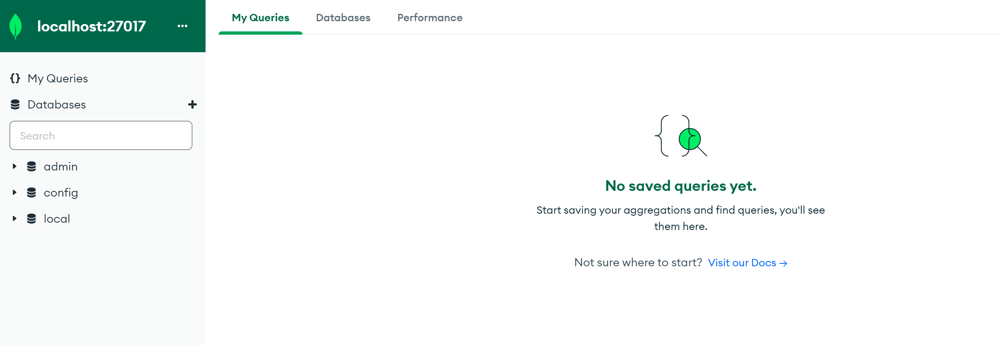
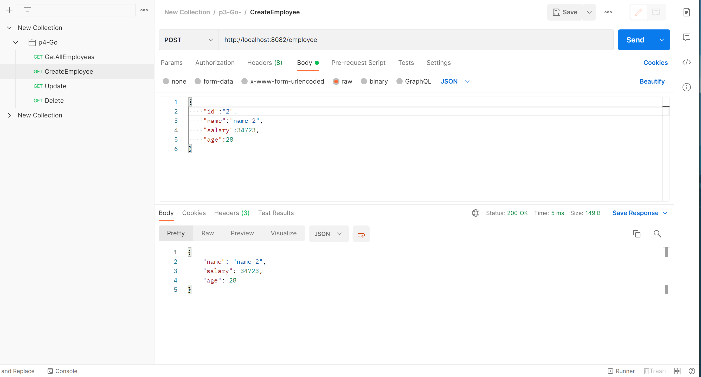
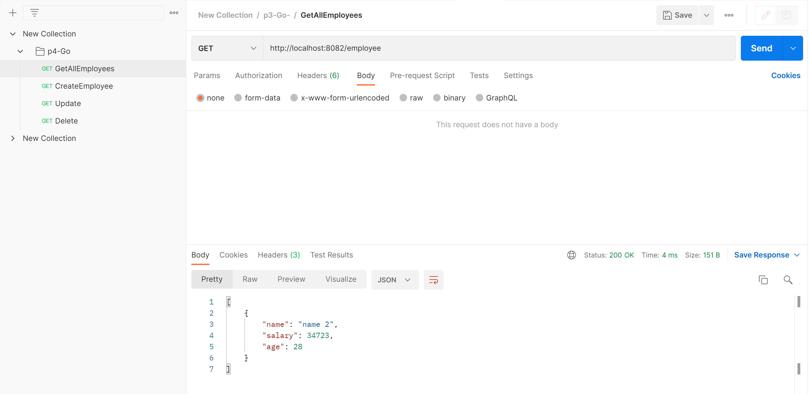
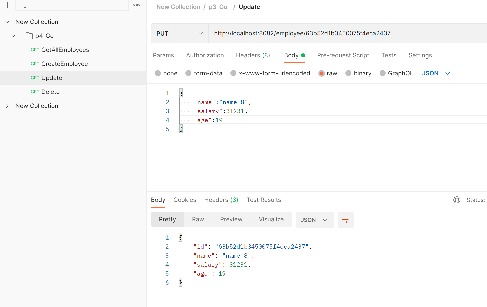
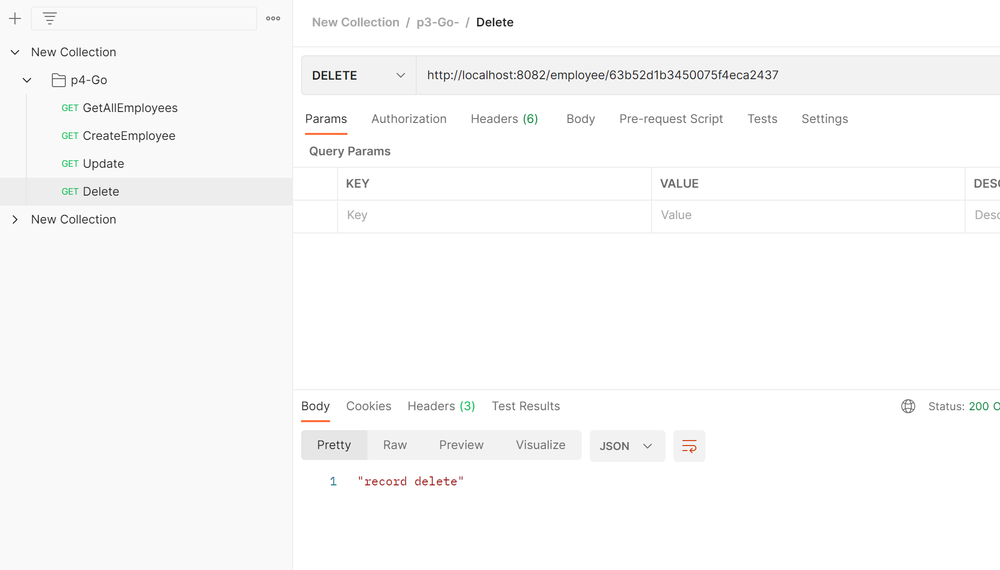

# 实现功能

Fiber + MongoDB 实现基本的CURD


# MongoDB安装

## Windows

### 1. [下载安装包](https://www.mongodb.com/try/download/community)

### 2. [下载 MongoDB Compass]( https://www.mongodb.com/download-center/compass)

### 3. 安装注意


### 4. 安装完成后

1. 在安装目录的data文件文件夹中手动新建**db**文件夹

2. 在bin文件夹中打开cmd，输入命令:[mongod -dbpath D:\MongoDB\Server\6.0\data\db]

```
D:\MongoDB\Server\6.0\bin>mongod -dbpath D:\MongoDB\Server\6.0\data\db
```

3. 打开Compass连接 `需要在上面的命令执行的情况下`




# Bson与Json格式

​	BSON是一种类json的一种**二进制形式的存储格式，简称Binary JSON**，它和JSON一样，支持内嵌的文档对象和数组对象，但是BSON有JSON没有的一些数据类型，如Date和BinData类型。
​	BSON可以做为网络数据交换的一种存储形式，这个有点类似于Google的Protocol Buffer，但是BSON是一种schema-less的存储形式，它的优点是灵活性高，但它的缺点是空间利用率不是很理想

`一个例子`

```
{
    name:"lemo",
    age:"12",
    address:{
        city:"suzhou",
        country:"china",
        code:215000
    } ,
    scores:[
        {"name":"english","grade:3.0},
        {"name":"chinese","grade:2.0}
    ]
}
```

# 测试







