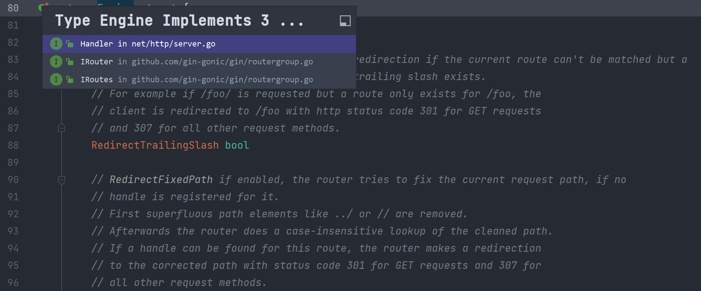

> 1. 更好的使用IDE来查看源码
>
> 通过i小按钮来查看实现的接口和接口的实现，快速找到源码



> 2. for循环的高效写法

```go
t := engine.trees
// 先计算出len长度
for i, tl := 0, len(t); i < tl; i++ {
	if t[i].method != httpMethod {
		continue
	}
}
```

> 3. 当需要多次重复使用变量时，使用池子可以减少gc的负担
> 4. 使用前先初始化，再使用可以防止污染

```go
// ServeHTTP conforms to the http.Handler interface.
func (engine *Engine) ServeHTTP(w http.ResponseWriter, req *http.Request) {
   // 使用池子管理变量
   c := engine.pool.Get().(*Context)
   c.writermem.reset(w)
   c.Request = req
   // 使用前先初始化，保证没受到污染
   c.reset()

   engine.handleHTTPRequest(c)

   engine.pool.Put(c)
}
```

> 5. 提前检测接口实现

```go
type Engine struct {
	...
}

// 把问题暴露在编译阶段，实例化Engine结构体，并立马丢掉，确保结构体实现了IRouter接口
var _ IRouter = &Engine{}
```

> 6. 如果已知需要分配的空间大小，尽量一开始就开辟完需要的空间

```go
trees:                  make(methodTrees, 0, 9), // Gin的分配策略
```

