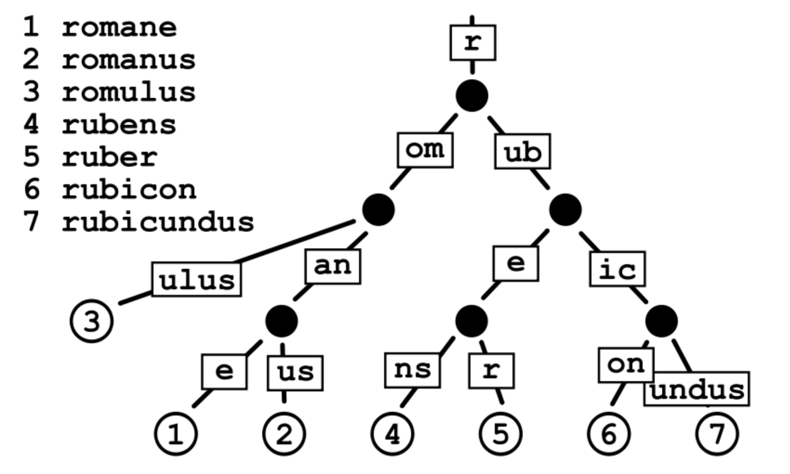
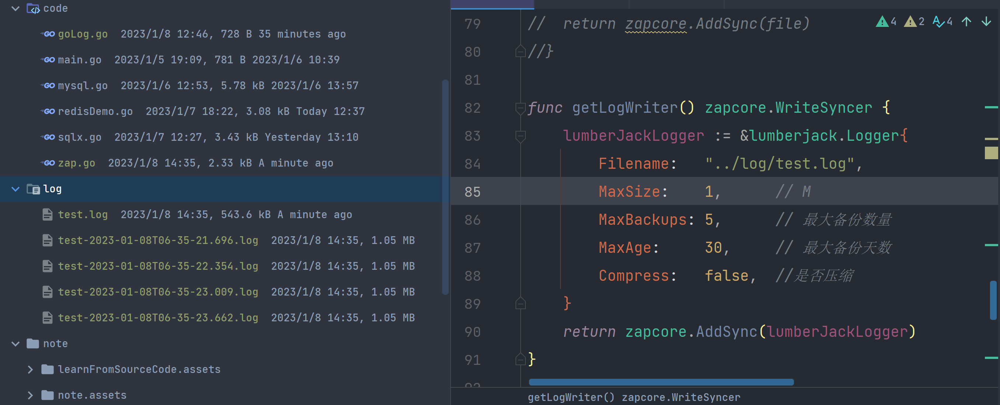
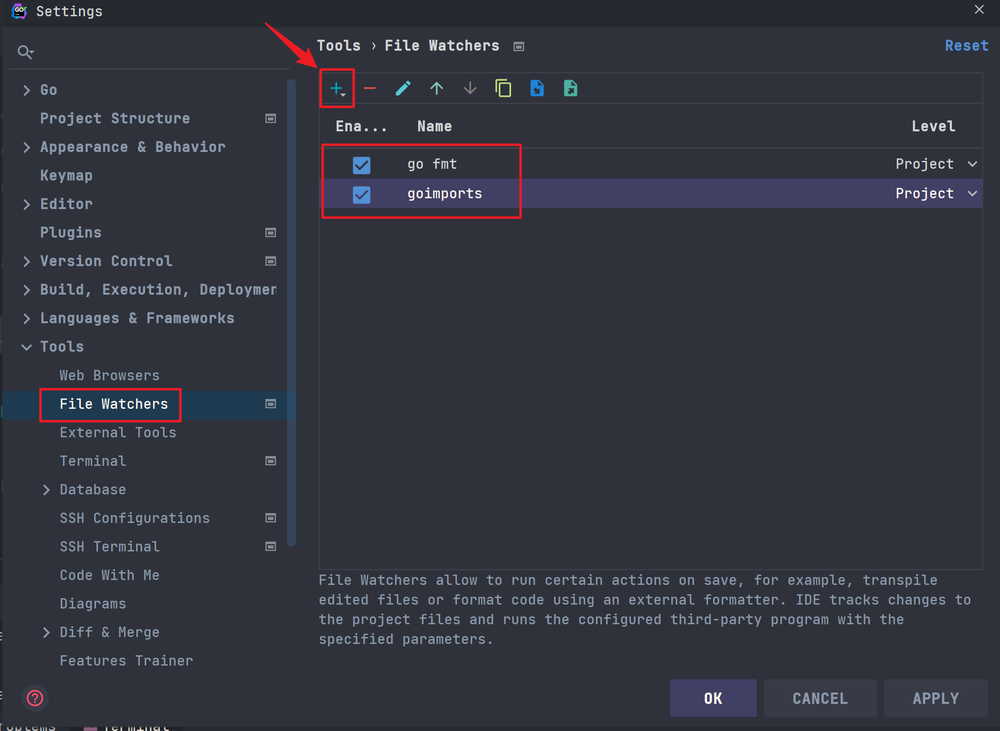

# Gin底层

## Gin路由

> 参考文章：[gin框架源码解析](https://www.liwenzhou.com/posts/Go/gin-sourcecode/)

gin框架使用的是定制版本的[httprouter](https://github.com/julienschmidt/httprouter)，其路由的原理是大量使用公共前缀的树结构，它基本上是一个紧凑的[Trie tree](https://baike.sogou.com/v66237892.htm)（或者只是[Radix Tree](https://baike.sogou.com/v73626121.htm)）。具有公共前缀的节点也共享一个公共父节点。

### Radix Tree

**基数树（Radix Tree）**又称为PAT位树（Patricia Trie or crit bit tree），是一种**更节省空间的前缀树（Trie Tree）**。对于基数树的每个节点，如果该节点是唯一的子树的话，就和父节点合并。下图为一个基数树示例：



#### 路由信息存储

`Radix Tree`可以被认为是一棵简洁版的前缀树。我们注册路由的过程就是构造前缀树的过程，具有公共前缀的节点也共享一个公共父节点。假设我们现在注册有以下路由信息：

```go
r := gin.Default()

r.GET("/", func1)
r.GET("/search/", func2)
r.GET("/support/", func3)
r.GET("/blog/", func4)
r.GET("/blog/:post/", func5)
r.GET("/about-us/", func6)
r.GET("/about-us/team/", func7)
r.GET("/contact/", func8)
```

那么我们会得到一个`GET`方法对应的路由树，具体结构如下：

```bash
Priority   Path             Handle
9          \                *<1>
3          ├s               nil
2          |├earch\         *<2>
1          |└upport\        *<3>
2          ├blog\           *<4>
1          |    └:post      nil
1          |         └\     *<5>
2          ├about-us\       *<6>
1          |        └team\  *<7>
1          └contact\        *<8>
```

上面最右边那一列每个`*<数字>`表示Handle处理函数的内存地址(一个指针)。从根节点遍历到叶子节点我们就能得到完整的路由表。

#### 管理策略

1. **路由器为每种请求方法[GET、POST、PUT、DELETE...]管理一棵单独的树**。一方面，它比在每个节点中都保存一个method-> handle map更加节省空间，它还使我们甚至可以在开始在前缀树中查找之前大大减少路由问题。

2. 为了获得更好的可伸缩性，每个树级别上的子节点都按`Priority(优先级)`排序，其中优先级（最左列）就是在子节点(子节点、子子节点等等)中注册的句柄的数量。这样做有两个好处:

   1. 首先优先匹配被大多数路由路径包含的节点。这样可以让尽可能多的路由快速被定位。
   2. 类似于`成本补偿`。**最长的路径可以被优先匹配，补偿体现在最长的路径需要花费更长的时间来定位**，如果最长路径的节点能被优先匹配（即每次拿子节点都命中），那么路由匹配所花的时间不一定比短路径的路由长。下面展示了节点（每个`-`可以看做一个节点）匹配的路径：从左到右，从上到下。

   ```bash
      ├------------
      ├---------
      ├-----
      ├----
      ├--
      ├--
      └-
   ```

### 对比hashMap存储方式

1. 匹配速度上：Map为O(1) > 基数树(log)
2. 空间利用上：基数树 > Map
3. 在占位符存储时(r.GET("/blog/:post/", func5))，基数树更加方便

### 路由树

> 路由树是由一个个节点构成的，gin框架路由树的节点由`node`结构体表示，它有以下字段：
>
> 底层存储是**slice**而不是一般的map

```go
type methodTree struct {
   method string
   root   *node
}

type methodTrees []methodTree

type node struct {
   // 节点路径，比如上面的s，earch，和upport
	path      string
	// 和children字段对应, 保存的是分裂的分支的第一个字符
	// 例如search和support, 那么s节点的indices对应的"eu"
	// 代表有两个分支, 分支的首字母分别是e和u
	indices   string
	// 儿子节点
	children  []*node
	// 处理函数链条（切片）
	handlers  HandlersChain
	// 优先级，子节点、子子节点等注册的handler数量
	priority  uint32
	// 节点类型，包括static, root, param, catchAll
	// static: 静态节点（默认），比如上面的s，earch等节点
	// root: 树的根节点
	// catchAll: 有*匹配的节点
	// param: 参数节点
	nType     nodeType
	// 路径上最大参数个数
	maxParams uint8
	// 节点是否是参数节点，比如上面的:post
	wildChild bool
	// 完整路径
	fullPath  string
}
```

可以在初始化路由树的时候看到，Gin直接一口气分配了9块内存空间，分别满足http1.1中的9中方法

```go
trees:                  make(methodTrees, 0, 9), //Gin的初始化分配策略 
```

## Gin 中间件

### 执行顺序

> 没有Abort()

```go
func func1(c *gin.Context){
   fmt.Println("func1")
}

func func2(c *gin.Context){
   fmt.Println("func2 before")
   c.Next()
   fmt.Println("func2 after")
}

func func3(c *gin.Context){
    fmt.Println("func3")
   //c.Abort()
}

func func4(c *gin.Context){
   fmt.Println("func1")
}

func func5(c *gin.Context){
   fmt.Println("func1")
}

func main() {

   r := gin.Default()
   
   oneGroup := r.Group("/hello", func1,func2)
   oneGroup.Use(func3)
   
   {
      oneGroup.GET("/index",func4,func5)
   }

   r.Run()
}
```

func1
func2 before
func3
func4
func5
func2 after

> 使用Abort()

```go
func func1(c *gin.Context){
   fmt.Println("func1")
}

func func2(c *gin.Context){
   fmt.Println("func2 before")
   c.Next()
   fmt.Println("func2 after")
}

func func3(c *gin.Context){
    fmt.Println("func3")
    c.Abort() // 这里使用了Abort
}

func func4(c *gin.Context){
   fmt.Println("func1")
}

func func5(c *gin.Context){
   fmt.Println("func1")
}
```

func1
func2 before
func3
func2 after

> 对 c *gin.Context的理解，相当于一根线，**贯穿着整个函数执行**，常见的作用就是**负责携带值**
>
> + c.Set("name","lido")
> + c.Get("name")
>
> Set()和Get()底层是**map**数据结构实现

```go
func func1(c *gin.Context){
	fmt.Println("func1")
	c.Set("name","lido")
}

func func2(c *gin.Context){
	fmt.Println("func2 before")
	c.Next()
	fmt.Println("func2 after")
}

func func3(c *gin.Context){
	fmt.Println("func3")
	v,ok := c.Get("name") // 获取值
	if ok {
		name := v.(string)
		fmt.Println(name) // 可以获取到lido
	}
	c.Abort()
}
```


# Gin源码

## 路由（一颗基数树的操作）

> Gin Handle方法

```go
func (group *RouterGroup) handle(httpMethod, relativePath string, handlers HandlersChain) IRoutes {
   // 拼接返回URL绝对路径
   absolutePath := group.calculateAbsolutePath(relativePath)
   handlers = group.combineHandlers(handlers)
   group.engine.addRoute(httpMethod, absolutePath, handlers)
   return group.returnObj()
}
```

> 合并操作

```go
func (group *RouterGroup) combineHandlers(handlers HandlersChain) HandlersChain {
   finalSize := len(group.Handlers) + len(handlers)
   assert1(finalSize < int(abortIndex), "too many handlers")
   mergedHandlers := make(HandlersChain, finalSize)
   // 先拷贝原来的处理方法
   copy(mergedHandlers, group.Handlers)
   // 再拷贝后来的处理方法
   copy(mergedHandlers[len(group.Handlers):], handlers)
   return mergedHandlers
}
```

> 路由注册

```go
func (engine *Engine) addRoute(method, path string, handlers HandlersChain) {
   assert1(path[0] == '/', "path must begin with '/'")
   assert1(method != "", "HTTP method can not be empty")
   assert1(len(handlers) > 0, "there must be at least one handler")

   debugPrintRoute(method, path, handlers)

   root := engine.trees.get(method)
   if root == nil {
      root = new(node)
      root.fullPath = "/"
      engine.trees = append(engine.trees, methodTree{method: method, root: root})
   }
   root.addRoute(path, handlers)

   // Update maxParams
   if paramsCount := countParams(path); paramsCount > engine.maxParams {
      engine.maxParams = paramsCount
   }

   if sectionsCount := countSections(path); sectionsCount > engine.maxSections {
      engine.maxSections = sectionsCount
   }
}
```

> 注册路由的逻辑主要有`addRoute`函数和`insertChild`方法。

```go
// tree.go

// addRoute 将具有给定句柄的节点添加到路径中。
// 不是并发安全的
func (n *node) addRoute(path string, handlers HandlersChain) {
	fullPath := path
	n.priority++
	numParams := countParams(path)  // 计算一下参数个数

	// 空树就直接插入当前节点
	if len(n.path) == 0 && len(n.children) == 0 {
		n.insertChild(numParams, path, fullPath, handlers)
		n.nType = root
		return
	}

	parentFullPathIndex := 0

walk:
	for {
		// 更新当前节点的最大参数个数
		if numParams > n.maxParams {
			n.maxParams = numParams
		}

		// 找到最长的通用前缀
		// 这也意味着公共前缀不包含“:”"或“*” /
		// 因为现有键不能包含这些字符。
		i := longestCommonPrefix(path, n.path)

		// 分裂边缘（此处分裂的是当前树节点）
		// 例如一开始path是search，新加入support，s是他们通用的最长前缀部分
		// 那么会将s拿出来作为parent节点，增加earch和upport作为child节点
		if i < len(n.path) {
			child := node{
				path:      n.path[i:],  // 公共前缀后的部分作为子节点
				wildChild: n.wildChild,
				indices:   n.indices,
				children:  n.children,
				handlers:  n.handlers,
				priority:  n.priority - 1, //子节点优先级-1
				fullPath:  n.fullPath,
			}

			// Update maxParams (max of all children)
			for _, v := range child.children {
				if v.maxParams > child.maxParams {
					child.maxParams = v.maxParams
				}
			}

			n.children = []*node{&child}
			// []byte for proper unicode char conversion, see #65
			n.indices = string([]byte{n.path[i]})
			n.path = path[:i]
			n.handlers = nil
			n.wildChild = false
			n.fullPath = fullPath[:parentFullPathIndex+i]
		}

		// 将新来的节点插入新的parent节点作为子节点
		if i < len(path) {
			path = path[i:]

			if n.wildChild {  // 如果是参数节点
				parentFullPathIndex += len(n.path)
				n = n.children[0]
				n.priority++

				// Update maxParams of the child node
				if numParams > n.maxParams {
					n.maxParams = numParams
				}
				numParams--

				// 检查通配符是否匹配
				if len(path) >= len(n.path) && n.path == path[:len(n.path)] {
					// 检查更长的通配符, 例如 :name and :names
					if len(n.path) >= len(path) || path[len(n.path)] == '/' {
						continue walk
					}
				}

				pathSeg := path
				if n.nType != catchAll {
					pathSeg = strings.SplitN(path, "/", 2)[0]
				}
				prefix := fullPath[:strings.Index(fullPath, pathSeg)] + n.path
				panic("'" + pathSeg +
					"' in new path '" + fullPath +
					"' conflicts with existing wildcard '" + n.path +
					"' in existing prefix '" + prefix +
					"'")
			}
			// 取path首字母，用来与indices做比较
			c := path[0]

			// 处理参数后加斜线情况
			if n.nType == param && c == '/' && len(n.children) == 1 {
				parentFullPathIndex += len(n.path)
				n = n.children[0]
				n.priority++
				continue walk
			}

			// 检查路path下一个字节的子节点是否存在
			// 比如s的子节点现在是earch和upport，indices为eu
			// 如果新加一个路由为super，那么就是和upport有匹配的部分u，将继续分列现在的upport节点
			for i, max := 0, len(n.indices); i < max; i++ {
				if c == n.indices[i] {
					parentFullPathIndex += len(n.path)
					i = n.incrementChildPrio(i)
					n = n.children[i]
					continue walk
				}
			}

			// 否则就插入
			if c != ':' && c != '*' {
				// []byte for proper unicode char conversion, see #65
				// 注意这里是直接拼接第一个字符到n.indices
				n.indices += string([]byte{c})
				child := &node{
					maxParams: numParams,
					fullPath:  fullPath,
				}
				// 追加子节点
				n.children = append(n.children, child)
				n.incrementChildPrio(len(n.indices) - 1)
				n = child
			}
			n.insertChild(numParams, path, fullPath, handlers)
			return
		}

		// 已经注册过的节点
		if n.handlers != nil {
			panic("handlers are already registered for path '" + fullPath + "'")
		}
		n.handlers = handlers
		return
	}
}
```

> 其实上面的代码很好理解，大家可以参照动画尝试将以下情形代入上面的代码逻辑，体味整个路由树构造的详细过程：
>
> 1. 第一次注册路由，例如注册search
> 2. 继续注册一条没有公共前缀的路由，例如blog
> 3. 注册一条与先前注册的路由有公共前缀的路由，例如support


#### insertChild

```go
// tree.go
func (n *node) insertChild(numParams uint8, path string, fullPath string, handlers HandlersChain) {
  // 找到所有的参数
	for numParams > 0 {
		// 查找前缀直到第一个通配符
		wildcard, i, valid := findWildcard(path)
		if i < 0 { // 没有发现通配符
			break
		}

		// 通配符的名称必须包含':' 和 '*'
		if !valid {
			panic("only one wildcard per path segment is allowed, has: '" +
				wildcard + "' in path '" + fullPath + "'")
		}

		// 检查通配符是否有名称
		if len(wildcard) < 2 {
			panic("wildcards must be named with a non-empty name in path '" + fullPath + "'")
		}

		// 检查这个节点是否有已经存在的子节点
		// 如果我们在这里插入通配符，这些子节点将无法访问
		if len(n.children) > 0 {
			panic("wildcard segment '" + wildcard +
				"' conflicts with existing children in path '" + fullPath + "'")
		}

		if wildcard[0] == ':' { // param
			if i > 0 {
				// 在当前通配符之前插入前缀
				n.path = path[:i]
				path = path[i:]
			}

			n.wildChild = true
			child := &node{
				nType:     param,
				path:      wildcard,
				maxParams: numParams,
				fullPath:  fullPath,
			}
			n.children = []*node{child}
			n = child
			n.priority++
			numParams--

			// 如果路径没有以通配符结束
			// 那么将有另一个以'/'开始的非通配符子路径。
			if len(wildcard) < len(path) {
				path = path[len(wildcard):]

				child := &node{
					maxParams: numParams,
					priority:  1,
					fullPath:  fullPath,
				}
				n.children = []*node{child}
				n = child  // 继续下一轮循环
				continue
			}

			// 否则我们就完成了。将处理函数插入新叶子中
			n.handlers = handlers
			return
		}

		// catchAll
		if i+len(wildcard) != len(path) || numParams > 1 {
			panic("catch-all routes are only allowed at the end of the path in path '" + fullPath + "'")
		}

		if len(n.path) > 0 && n.path[len(n.path)-1] == '/' {
			panic("catch-all conflicts with existing handle for the path segment root in path '" + fullPath + "'")
		}

		// currently fixed width 1 for '/'
		i--
		if path[i] != '/' {
			panic("no / before catch-all in path '" + fullPath + "'")
		}

		n.path = path[:i]
		
		// 第一个节点:路径为空的catchAll节点
		child := &node{
			wildChild: true,
			nType:     catchAll,
			maxParams: 1,
			fullPath:  fullPath,
		}
		// 更新父节点的maxParams
		if n.maxParams < 1 {
			n.maxParams = 1
		}
		n.children = []*node{child}
		n.indices = string('/')
		n = child
		n.priority++

		// 第二个节点:保存变量的节点
		child = &node{
			path:      path[i:],
			nType:     catchAll,
			maxParams: 1,
			handlers:  handlers,
			priority:  1,
			fullPath:  fullPath,
		}
		n.children = []*node{child}

		return
	}

	// 如果没有找到通配符，只需插入路径和句柄
	n.path = path
	n.handlers = handlers
	n.fullPath = fullPath
}
```

`insertChild`函数是根据`path`本身进行分割，将`/`分开的部分分别作为节点保存，形成一棵树结构。参数匹配中的`:`和`*`的区别是，前者是匹配一个字段而后者是匹配后面所有的路径。

> 路由匹配
>
> 存储的参数是slice，而不是map
>
> 我们先来看gin框架处理请求的入口函数`ServeHTTP`：

```go
// gin.go
func (engine *Engine) ServeHTTP(w http.ResponseWriter, req *http.Request) {
  // 这里使用了对象池
	c := engine.pool.Get().(*Context)
  // 这里有一个细节就是Get对象后做初始化
	c.writermem.reset(w)
	c.Request = req
	c.reset()

	engine.handleHTTPRequest(c)  // 我们要找的处理HTTP请求的函数

	engine.pool.Put(c)  // 处理完请求后将对象放回池子
}
```

函数很长，这里省略了部分代码，只保留相关逻辑代码：

```go
// gin.go
func (engine *Engine) handleHTTPRequest(c *Context) {
	// liwenzhou.com...

	// 根据请求方法找到对应的路由树
	t := engine.trees
	for i, tl := 0, len(t); i < tl; i++ {
		if t[i].method != httpMethod {
			continue
		}
		root := t[i].root
		// 在路由树中根据path查找
		value := root.getValue(rPath, c.Params, unescape)
		if value.handlers != nil {
			c.handlers = value.handlers
			c.Params = value.params
			c.fullPath = value.fullPath
			c.Next()  // 执行函数链条
			c.writermem.WriteHeaderNow()
			return
		}
	
	// liwenzhou.com...
	c.handlers = engine.allNoRoute
	serveError(c, http.StatusNotFound, default404Body)
}
```

路由匹配是由节点的 `getValue`方法实现的。`getValue`根据给定的路径(键)返回`nodeValue`值，保存注册的处理函数和匹配到的路径参数数据。

如果找不到任何处理函数，则会尝试TSR(尾随斜杠重定向)。

代码虽然很长，但还算比较工整。大家可以借助注释看一下路由查找及参数匹配的逻辑。

```go
// tree.go

type nodeValue struct {
	handlers HandlersChain
	params   Params  // []Param
	tsr      bool
	fullPath string
}

// liwenzhou.com...

func (n *node) getValue(path string, po Params, unescape bool) (value nodeValue) {
	value.params = po
walk: // Outer loop for walking the tree
	for {
		prefix := n.path
		if path == prefix {
			// 我们应该已经到达包含处理函数的节点。
			// 检查该节点是否注册有处理函数
			if value.handlers = n.handlers; value.handlers != nil {
				value.fullPath = n.fullPath
				return
			}

			if path == "/" && n.wildChild && n.nType != root {
				value.tsr = true
				return
			}

			// 没有找到处理函数 检查这个路径末尾+/ 是否存在注册函数
			indices := n.indices
			for i, max := 0, len(indices); i < max; i++ {
				if indices[i] == '/' {
					n = n.children[i]
					value.tsr = (len(n.path) == 1 && n.handlers != nil) ||
						(n.nType == catchAll && n.children[0].handlers != nil)
					return
				}
			}

			return
		}

		if len(path) > len(prefix) && path[:len(prefix)] == prefix {
			path = path[len(prefix):]
			// 如果该节点没有通配符(param或catchAll)子节点
			// 我们可以继续查找下一个子节点
			if !n.wildChild {
				c := path[0]
				indices := n.indices
				for i, max := 0, len(indices); i < max; i++ {
					if c == indices[i] {
						n = n.children[i] // 遍历树
						continue walk
					}
				}

				// 没找到
				// 如果存在一个相同的URL但没有末尾/的叶子节点
				// 我们可以建议重定向到那里
				value.tsr = path == "/" && n.handlers != nil
				return
			}

			// 根据节点类型处理通配符子节点
			n = n.children[0]
			switch n.nType {
			case param:
				// find param end (either '/' or path end)
				end := 0
				for end < len(path) && path[end] != '/' {
					end++
				}

				// 保存通配符的值
				if cap(value.params) < int(n.maxParams) {
					value.params = make(Params, 0, n.maxParams)
				}
				i := len(value.params)
				value.params = value.params[:i+1] // 在预先分配的容量内扩展slice
				value.params[i].Key = n.path[1:]
				val := path[:end]
				if unescape {
					var err error
					if value.params[i].Value, err = url.QueryUnescape(val); err != nil {
						value.params[i].Value = val // fallback, in case of error
					}
				} else {
					value.params[i].Value = val
				}

				// 继续向下查询
				if end < len(path) {
					if len(n.children) > 0 {
						path = path[end:]
						n = n.children[0]
						continue walk
					}

					// ... but we can't
					value.tsr = len(path) == end+1
					return
				}

				if value.handlers = n.handlers; value.handlers != nil {
					value.fullPath = n.fullPath
					return
				}
				if len(n.children) == 1 {
					// 没有找到处理函数. 检查此路径末尾加/的路由是否存在注册函数
					// 用于 TSR 推荐
					n = n.children[0]
					value.tsr = n.path == "/" && n.handlers != nil
				}
				return

			case catchAll:
				// 保存通配符的值
				if cap(value.params) < int(n.maxParams) {
					value.params = make(Params, 0, n.maxParams)
				}
				i := len(value.params)
				value.params = value.params[:i+1] // 在预先分配的容量内扩展slice
				value.params[i].Key = n.path[2:]
				if unescape {
					var err error
					if value.params[i].Value, err = url.QueryUnescape(path); err != nil {
						value.params[i].Value = path // fallback, in case of error
					}
				} else {
					value.params[i].Value = path
				}

				value.handlers = n.handlers
				value.fullPath = n.fullPath
				return

			default:
				panic("invalid node type")
			}
		}

		// 找不到，如果存在一个在当前路径最后添加/的路由
		// 我们会建议重定向到那里
		value.tsr = (path == "/") ||
			(len(prefix) == len(path)+1 && prefix[len(path)] == '/' &&
				path == prefix[:len(prefix)-1] && n.handlers != nil)
		return
	}
}
```

## 中间件

> Default 默认使用 Logger(), Recovery()
>
> + 日志 和 panic后的恢复

```go
// Default returns an Engine instance with the Logger and Recovery middleware already attached.
func Default() *Engine {
   debugPrintWARNINGDefault()
   engine := New()
   engine.Use(Logger(), Recovery())
   return engine
}
```

继续往下查看一下`Use()`函数的代码：

```go
func (engine *Engine) Use(middleware ...HandlerFunc) IRoutes {
	engine.RouterGroup.Use(middleware...)  // 实际上还是调用的RouterGroup的Use函数
	engine.rebuild404Handlers()
	engine.rebuild405Handlers()
	return engine
}
```

从下方的代码可以看出，注册中间件其实就是将中间件函数追加到`group.Handlers`中：

```go
func (group *RouterGroup) Use(middleware ...HandlerFunc) IRoutes {
    // append直接添加
	group.Handlers = append(group.Handlers, middleware...)
	return group.returnObj()
}

func (group *RouterGroup) returnObj() IRoutes {
	if group.root {
		return group.engine
	}
	return group
}
```

而我们注册路由时会将对应**路由的函数和之前的中间件函数结合**到一起：

```go
func (group *RouterGroup) handle(httpMethod, relativePath string, handlers HandlersChain) IRoutes {
	absolutePath := group.calculateAbsolutePath(relativePath)
	handlers = group.combineHandlers(handlers)  // 将处理请求的函数与中间件函数结合
	group.engine.addRoute(httpMethod, absolutePath, handlers)
	return group.returnObj()
}
```

其中结合操作的函数内容如下，注意观察这里是如何实现拼接两个切片得到一个新切片的。

```go
const abortIndex int8 = math.MaxInt8 / 2

func (group *RouterGroup) combineHandlers(handlers HandlersChain) HandlersChain {
	finalSize := len(group.Handlers) + len(handlers)
	if finalSize >= int(abortIndex) {  // 这里有一个最大限制
		panic("too many handlers")
	}
	mergedHandlers := make(HandlersChain, finalSize)
	copy(mergedHandlers, group.Handlers)
	copy(mergedHandlers[len(group.Handlers):], handlers)
	return mergedHandlers
}
```

也就是说，我们会将一个路由的中间件函数和处理函数**结合**到一起组成一条处理函数链条`HandlersChain`，而它本质上就是一个由`HandlerFunc`组成的切片：

也就是最终都会放到树上

```go
type HandlersChain []HandlerFunc
```

> Next() 
>
> **顺序递归嵌套**调用函数的中间件

```go
// Next should be used only inside middleware.
// It executes the pending handlers in the chain inside the calling handler.
// See example in GitHub.
func (c *Context) Next() {
   c.index++
   for c.index < int8(len(c.handlers)) {
      c.handlers[c.index](c) // 遍历调用
      c.index++
   }
}
```

> Abort()  直接中断
>
> 本质就是直接将调用链条中的索引置为最大值，也就不满足Next()中for的循环条件 

```go
// Abort prevents pending handlers from being called. Note that this will not stop the current handler.
// Let's say you have an authorization middleware that validates that the current request is authorized.
// If the authorization fails (ex: the password does not match), call Abort to ensure the remaining handlers
// for this request are not called.
func (c *Context) Abort() {
   c.index = abortIndex
}

// abortIndex represents a typical value used in abort functions.
const abortIndex int8 = math.MaxInt8 >> 1
```

# Gin其他操作

> 参考文章: [李文周的博客](https://www.liwenzhou.com/)
>
> 1. [优雅地关机或重启](https://www.liwenzhou.com/posts/Go/graceful-shutdown/)
> 2. 

## 优雅关机与重启

### 什么是优雅关机？

优雅关机就是服务端关机命令发出后不是立即关机，而是**等待当前还在处理的请求全部处理完毕后**再退出程序，是一种对客户端友好的关机方式。而执行`Ctrl+C`关闭服务端时，会强制结束进程导致正在访问的请求出现问题。

### 如何实现优雅关机？

Go 1.8版本之后， http.Server 内置的 [Shutdown()](https://golang.org/pkg/net/http/#Server.Shutdown) 方法就支持优雅地关机，具体示例如下：

```go
func main() {
	router := gin.Default()
	router.GET("/", func(c *gin.Context) {
		time.Sleep(10 * time.Second)
		c.String(http.StatusOK, "Welcome Gin Server")
	})

	srv := &http.Server{
		Addr:    ":8081",
		Handler: router,
	}

	go func() {
		// 开启一个goroutine启动服务
		if err := srv.ListenAndServe(); err != nil && err != http.ErrServerClosed {
			log.Fatalf("listen: %s\n", err)
		}
	}()

	/*
		等待中断信号来优雅地关闭服务器，为关闭服务器操作设置一个5秒的超时
	*/
	quit := make(chan os.Signal, 1) // 创建一个接收信号的通道
	// kill 默认会发送 syscall.SIGTERM 信号
	// kill -2 发送 syscall.SIGINT 信号，我们常用的Ctrl+C就是触发系统SIGINT信号
	// kill -9 发送 syscall.SIGKILL 信号，但是不能被捕获，所以不需要添加它
	// signal.Notify把收到的 syscall.SIGINT或syscall.SIGTERM 信号转发给quit
	signal.Notify(quit, syscall.SIGINT, syscall.SIGTERM) // 此处不会阻塞
	<-quit                                               // 阻塞在此，当接收到上述两种信号时才会往下执行
	log.Println("Shutdown Server ...")
	
	// 创建一个5秒超时的context
	ctx, cancel := context.WithTimeout(context.Background(), 20*time.Second)
	defer cancel()
	// 5秒内优雅关闭服务（将未处理完的请求处理完再关闭服务），超过5秒就超时退出
	if err := srv.Shutdown(ctx); err != nil {
		log.Fatal("Server Shutdown: ", err)
	}

	log.Println("Server exiting")
}
```

如何验证优雅关机的效果呢？

上面的代码运行后会在本地的`8081`端口开启一个web服务，它只注册了一条路由`/`，后端服务会先sleep 5秒钟然后才返回响应信息。

我们按下`Ctrl+C`时会发送`syscall.SIGINT`来通知程序优雅关机，具体做法如下：

1. 打开终端，编译并执行上面的代码
2. 打开一个浏览器，访问`127.0.0.1:8080/`，此时浏览器白屏等待服务端返回响应。
3. 在终端**迅速**执行`Ctrl+C`命令给程序发送`syscall.SIGINT`信号
4. 此时程序并不立即退出而是等我们第2步的响应返回之后再退出，从而实现优雅关机。

### 优雅地重启

> 思路：
>
> 1. 先fork一个父进程
> 2. 重启命令**发出前**的请求由**父进程处理**
> 3. 重启命令**发出后**的请求由**新的进程处理**

优雅关机实现了，那么该如何实现优雅重启呢？

我们可以使用 [fvbock/endless](https://github.com/fvbock/endless) 来替换默认的 `ListenAndServe`启动服务来实现， 示例代码如下：

```go
package main

import (
	"log"
	"net/http"
	"time"

	"github.com/fvbock/endless"
	"github.com/gin-gonic/gin"
)

func main() {
	router := gin.Default()
	router.GET("/", func(c *gin.Context) {
		time.Sleep(5 * time.Second)
		c.String(http.StatusOK, "hello gin!")
	})
	// 默认endless服务器会监听下列信号：
	// syscall.SIGHUP，syscall.SIGUSR1，syscall.SIGUSR2，syscall.SIGINT，syscall.SIGTERM和syscall.SIGTSTP
	// 接收到 SIGHUP 信号将触发`fork/restart` 实现优雅重启（kill -1 pid会发送SIGHUP信号）
	// 接收到 syscall.SIGINT或syscall.SIGTERM 信号将触发优雅关机
	// 接收到 SIGUSR2 信号将触发HammerTime
	// SIGUSR1 和 SIGTSTP 被用来触发一些用户自定义的hook函数
	if err := endless.ListenAndServe(":8080", router); err!=nil{
		log.Fatalf("listen: %s\n", err)
	}

	log.Println("Server exiting")
}
```

如何验证优雅重启的效果呢？

我们通过执行`kill -1 pid`命令发送`syscall.SIGINT`来通知程序优雅重启，具体做法如下：

1. 打开终端，`go build -o graceful_restart`编译并执行`./graceful_restart`,终端输出当前pid(假设为43682)
2. 将代码中处理请求函数返回的`hello gin!`修改为`hello q1mi!`，再次编译`go build -o graceful_restart`
3. 打开一个浏览器，访问`127.0.0.1:8080/`，此时浏览器白屏等待服务端返回响应。
4. 在终端**迅速**执行`kill -1 43682`命令给程序发送`syscall.SIGHUP`信号
5. 等第3步浏览器收到响应信息`hello gin!`后再次访问`127.0.0.1:8080/`会收到`hello q1mi!`的响应。
6. 在不影响当前未处理完请求的同时完成了程序代码的替换，实现了优雅重启。

！！！ 但是需要**注意**的是，此时程序的PID变化了，因为`endless` 是通过`fork`子进程处理新请求，待原进程处理完当前请求后再退出的方式实现优雅重启的。所以当你的项目是使用类似`supervisor`的软件管理进程时就**不适用**这种方式了。

### 总结

​	无论是优雅关机还是优雅重启归根结底都是通过**监听特定系统信号**，然后执行一定的逻辑处理保障当前系统正在处理的请求被正常处理后再关闭当前进程。使用优雅关机还是使用优雅重启以及怎么实现，这就需要根据项目实际情况来决定了。

# Mysql

> 参考文章：[Go操作MySQL](https://www.liwenzhou.com/posts/Go/mysql/)

## 安装使用

### 下载依赖

```bash
go get -u github.com/go-sql-driver/mysql
```

### 使用MySQL驱动

```go
func Open(driverName, dataSourceName string) (*DB, error)
```

Open打开一个dirverName指定的数据库，dataSourceName指定数据源，一般至少包括数据库文件名和其它连接必要的信息。

```go
import (
	"database/sql"

	_ "github.com/go-sql-driver/mysql"
)

func main() {
   // DSN:Data Source Name
	dsn := "user:password@tcp(127.0.0.1:3306)/dbname"
    // 仅检验字符串的格式，并没有真正的连接
	db, err := sql.Open("mysql", dsn)
	if err != nil {
		panic(err)
	}
    // 释放数据库连接的相关资源
	defer db.Close()  // 注意这行代码要写在上面err判断的下面
}
```

**思考题**： 为什么上面代码中的`defer db.Close()`语句不应该写在`if err != nil`的前面呢？

因为要确保db不为空，才能关

### 初始化连接（模块化）

Open函数可能只是验证其参数格式是否正确，实际上并不创建与数据库的连接。如果要检查数据源的名称是否真实有效，应该调用Ping方法。

返回的DB对象可以安全地被多个goroutine并发使用，并且维护其自己的空闲连接池。因此，Open函数应该仅被调用一次，很少需要关闭这个DB对象。

接下来，我们定义一个全局变量`db`，用来保存数据库连接对象。将上面的示例代码拆分出一个独立的`initDB`函数，只需要在程序启动时调用一次该函数完成全局变量db的初始化，其他函数中就可以直接使用全局变量`db`了。（**注意下方的注意**）

```go
package main

import (
   "database/sql"
   "fmt"
   _ "github.com/go-sql-driver/mysql"
)

// 定义一个全局对象db
var db *sql.DB

// 定义一个初始化数据库的函数
func initDB() (err error) {
   // DSN:Data Source Name
   //dsn := "user:password@tcp(127.0.0.1:3306)/sql_test?charset=utf8mb4&parseTime=True"
   dsn := "root:rootroot@tcp(127.0.0.1:3306)/test?charset=utf8mb4&parseTime=True"
   // 不会校验账号密码是否正确
   // 注意！！！这里不要使用:=，我们是给全局变量赋值，然后在main函数中使用全局变量db
   db, err = sql.Open("mysql", dsn)
   if err != nil {
      return err
   }
   // 尝试与数据库建立连接（校验dsn是否正确）
   // 真正的测试连接
   err = db.Ping()
   if err != nil {
      return err
   }
    
   // Mysql配置
   db.SetConnMaxIdleTime(time.Second * 10) // 连接时间
   db.SetMaxOpenConns(200) // 最大连接数
   db.SetMaxIdleConns(20) // 空闲时的最大连接数
    
   return nil
}

func main() {
   err := initDB() // 调用输出化数据库的函数
   if err != nil {
      fmt.Printf("init db failed,err:%v\n", err)
      return
   }
}
```

### SetMaxOpenConns

```go
func (db *DB) SetMaxOpenConns(n int)
```

`SetMaxOpenConns`设置与数据库建立连接的最大数目。 如果n大于0且小于最大闲置连接数，会将最大闲置连接数减小到匹配最大开启连接数的限制。 如果n<=0，不会限制最大开启连接数，默认为0（无限制）。

### SetMaxIdleConns

```go
func (db *DB) SetMaxIdleConns(n int)
```

SetMaxIdleConns设置连接池中的最大闲置连接数。 如果n大于最大开启连接数，则新的最大闲置连接数会减小到匹配最大开启连接数的限制。 如果n<=0，不会保留闲置连接。

## DatabaseSql驱动注册原理

> `面向接口编程`
>
> Go官方仅提供一套SQL标准接口和驱动接口
>
> 剩下的如Mysql、Redis、PostgreSQL、Oracle等sql只要实现了接口和驱动，都可以使用

### Go提供接口

```go
type DB struct {
	// Atomic access only. At top of struct to prevent mis-alignment
	// on 32-bit platforms. Of type time.Duration.
	waitDuration int64 // Total time waited for new connections.

	connector driver.Connector
	// numClosed is an atomic counter which represents a total number of
	// closed connections. Stmt.openStmt checks it before cleaning closed
	// connections in Stmt.css.
	numClosed uint64

	......
}

type driverConn struct {
	db        *DB
	createdAt time.Time

	......
}

// Drivers returns a sorted list of the names of the registered drivers.
func Drivers() []string {
   driversMu.RLock()
   defer driversMu.RUnlock()
   list := make([]string, 0, len(drivers))
   for name := range drivers {
      list = append(list, name)
   }
   sort.Strings(list)
   return list
}
```

### 第三方的注册

```go
func init() {
   sql.Register("mysql", &MySQLDriver{})
}
```

## 原生的Mysql CURD

### 建库建表

我们先在MySQL中创建一个名为`sql_test`的数据库

```sql
CREATE DATABASE sql_test;
```

进入该数据库:

```sql
use sql_test;
```

执行以下命令创建一张用于测试的数据表：

```sql
CREATE TABLE `user` (
    `id` BIGINT(20) NOT NULL AUTO_INCREMENT,
    `name` VARCHAR(20) DEFAULT '',
    `age` INT(11) DEFAULT '0',
    PRIMARY KEY(`id`)
)ENGINE=InnoDB AUTO_INCREMENT=1 DEFAULT CHARSET=utf8mb4;
```

### 查询

#### 单行查询

单行查询`db.QueryRow()`执行一次查询，并期望返回最多一行结果（即Row）。QueryRow总是返回非nil的值，直到返回值的Scan方法被调用时，才会返回被延迟的错误。（如：未找到结果）

```go
func (db *DB) QueryRow(query string, args ...interface{}) *Row
```

具体示例代码：

```go
// 查询单条数据示例
func queryRowDemo() {
	sqlStr := "select id, name, age from user where id=?"
	var u user
	// 非常重要：确保QueryRow之后调用Scan方法，否则持有的数据库链接不会被释放
    row := db.QueryRow(sqlStr, 1)
    err := row.Scan(&u.id, &u.name, &u.age)
    
    // 保证释放的写法
    row = db.QueryRow(sqlStr, 1).Scan(&u.id, &u.name, &u.age)
    
	if err != nil {
		fmt.Printf("scan failed, err:%v\n", err)
		return
	}
	fmt.Printf("id:%d name:%s age:%d\n", u.id, u.name, u.age)
}
```

> `小坑` 注意查询完要及时释放连接

```go
// 非常重要：确保QueryRow之后调用Scan方法，否则持有的数据库链接不会被释放
// row如果不调用Scan方法，会一直持有连接资源
// 当Mysql最大连接数设置为1时，则会阻塞，导致后面无法继续执行

db.SetMaxOpenConns(200) // 最大连接数

row := db.QueryRow(sqlStr, 1) 
row = db.QueryRow(sqlStr, 2) // 会阻塞 
err := row.Scan(&u.id, &u.name, &u.age)
```

```go
func (r *Row) Scan(dest ...interface{}) error {
   if r.err != nil {
      return r.err
   }

   defer r.rows.Close() // 释放连接资源
   ......
}
```

#### 多行查询

多行查询`db.Query()`执行一次查询，返回多行结果（即Rows），一般用于执行select命令。参数args表示query中的占位参数。

```go
func (db *DB) Query(query string, args ...interface{}) (*Rows, error)
```

具体示例代码：

```go
// 查询多条数据示例
func queryMultiRowDemo() {
	sqlStr := "select id, name, age from user where id > ?"
	rows, err := db.Query(sqlStr, 0)
	if err != nil {
		fmt.Printf("query failed, err:%v\n", err)
		return
	}
	// 非常重要：关闭rows释放持有的数据库链接
	defer rows.Close()

	// 循环读取结果集中的数据
	for rows.Next() {
		var u user
		err := rows.Scan(&u.id, &u.name, &u.age)
		if err != nil {
			fmt.Printf("scan failed, err:%v\n", err)
			return
		}
		fmt.Printf("id:%d name:%s age:%d\n", u.id, u.name, u.age)
	}
}
```

### 插入数据

插入、更新和删除操作都使用`Exec`方法。

```go
func (db *DB) Exec(query string, args ...interface{}) (Result, error)
```

Exec执行一次命令（包括查询、删除、更新、插入等），返回的Result是对已执行的SQL命令的总结。参数args表示query中的占位参数。

具体插入数据示例代码如下：

```go
// 插入数据
func insertRowDemo() {
	sqlStr := "insert into user(name, age) values (?,?)"
	ret, err := db.Exec(sqlStr, "LiMing", 38)
	if err != nil {
		fmt.Printf("insert failed, err:%v\n", err)
		return
	}
	theID, err := ret.LastInsertId() // 新插入数据的id
	if err != nil {
		fmt.Printf("get lastinsert ID failed, err:%v\n", err)
		return
	}
	fmt.Printf("insert success, the id is %d.\n", theID)
}
```

### 更新数据

具体更新数据示例代码如下：

```go
// 更新数据
func updateRowDemo() {
	sqlStr := "update user set age=? where id = ?"
	ret, err := db.Exec(sqlStr, 39, 3)
	if err != nil {
		fmt.Printf("update failed, err:%v\n", err)
		return
	}
	n, err := ret.RowsAffected() // 操作影响的行数
	if err != nil {
		fmt.Printf("get RowsAffected failed, err:%v\n", err)
		return
	}
	fmt.Printf("update success, affected rows:%d\n", n)
}
```

### 删除数据

具体删除数据的示例代码如下：

```go
// 删除数据
func deleteRowDemo() {
	sqlStr := "delete from user where id = ?"
	ret, err := db.Exec(sqlStr, 3)
	if err != nil {
		fmt.Printf("delete failed, err:%v\n", err)
		return
	}
	n, err := ret.RowsAffected() // 操作影响的行数
	if err != nil {
		fmt.Printf("get RowsAffected failed, err:%v\n", err)
		return
	}
	fmt.Printf("delete success, affected rows:%d\n", n)
}
```

## MySQL预处理

### 什么是预处理？

普通SQL语句执行过程：

1. 客户端对SQL语句进行占位符替换得到完整的SQL语句。
2. 客户端发送完整SQL语句到MySQL服务端
3. MySQL服务端执行完整的SQL语句并将结果返回给客户端。

预处理执行过程：

1. 把SQL语句分成两部分，命令部分与数据部分。
2. 先把命令部分发送给MySQL服务端，MySQL服务端进行SQL预处理。
3. 然后把数据部分发送给MySQL服务端，MySQL服务端对SQL语句进行占位符替换。
4. MySQL服务端执行完整的SQL语句并将结果返回给客户端。

### 为什么要预处理？

1. 优化MySQL服务器重复执行SQL的方法，可以提升服务器性能，提前让服务器编译，一次编译多次执行，节省后续编译的成本。
2. 避免SQL注入问题。

### Go实现MySQL预处理

`database/sql`中使用下面的`Prepare`方法来实现预处理操作。

```go
func (db *DB) Prepare(query string) (*Stmt, error)
```

`Prepare`方法会先将sql语句发送给MySQL服务端，返回一个准备好的状态用于之后的查询和命令。返回值可以同时执行多个查询和命令。

查询操作的预处理示例代码如下：

```go
// 预处理查询示例
func prepareQueryDemo() {
	sqlStr := "select id, name, age from user where id > ?"
	stmt, err := db.Prepare(sqlStr)
	if err != nil {
		fmt.Printf("prepare failed, err:%v\n", err)
		return
	}
	defer stmt.Close()
    
	rows, err := stmt.Query(0)
	if err != nil {
		fmt.Printf("query failed, err:%v\n", err)
		return
	}
	defer rows.Close()
    
	// 循环读取结果集中的数据
	for rows.Next() {
		var u user
		err := rows.Scan(&u.id, &u.name, &u.age)
		if err != nil {
			fmt.Printf("scan failed, err:%v\n", err)
			return
		}
		fmt.Printf("id:%d name:%s age:%d\n", u.id, u.name, u.age)
	}
}
```

插入、更新和删除操作的预处理十分类似，这里以插入操作的预处理为例：

```go
// 预处理插入示例
func prepareInsertDemo() {
	sqlStr := "insert into user(name, age) values (?,?)"
	stmt, err := db.Prepare(sqlStr)
	if err != nil {
		fmt.Printf("prepare failed, err:%v\n", err)
		return
	}
	defer stmt.Close()
    
	_, err = stmt.Exec("XiaoMing", 18)
	if err != nil {
		fmt.Printf("insert failed, err:%v\n", err)
		return
	}
	_, err = stmt.Exec("XiaoWang", 18)
	if err != nil {
		fmt.Printf("insert failed, err:%v\n", err)
		return
	}
	fmt.Println("insert success.")
}
```

### SQL注入问题

**我们任何时候都不应该自己拼接SQL语句！**

这里我们演示一个自行拼接SQL语句的示例，编写一个根据name字段查询user表的函数如下：

```go
// sql注入示例
func sqlInjectDemo(name string) {
	sqlStr := fmt.Sprintf("select id, name, age from user where name='%s'", name)
	fmt.Printf("SQL:%s\n", sqlStr)
	var u user
	err := db.QueryRow(sqlStr).Scan(&u.id, &u.name, &u.age)
	if err != nil {
		fmt.Printf("exec failed, err:%v\n", err)
		return
	}
	fmt.Printf("user:%#v\n", u)
}

func sqlInjectDemo(name string) {
	sqlStr := fmt.Sprintf("select id, name, age from user where name='%s'", name)
	fmt.Printf("SQL:%s\n", sqlStr)

	rows, err := db.Query(sqlStr) // 多行查询如果被注入数据可能全部被查询到
	......
}
```

此时以下输入字符串都可以引发SQL注入问题：

```go
sqlInjectDemo("xxx' or 1=1#") // 脱库 '#'表示后面注释 
sqlInjectDemo("xxx' union select * from user #")
sqlInjectDemo("xxx' and (select count(*) from user) <10 #")
```

**补充：**不同的数据库中，SQL语句使用的占位符语法不尽相同。

|   数据库   |  占位符语法  |
| :--------: | :----------: |
|   MySQL    |     `?`      |
| PostgreSQL | `$1`, `$2`等 |
|   SQLite   |  `?` 和`$1`  |
|   Oracle   |   `:name`    |

## MySQL事务

### 什么是事务？

事务：一个**最小的不可再分的工作单元**；通常一个事务对应一个完整的业务(例如银行账户转账业务，该业务就是一个最小的工作单元)，同时这个完整的业务需要执行多次的DML(insert、update、delete)语句共同联合完成。A转账给B，这里面就需要执行两次update操作。

在MySQL中**只有**使用了`Innodb`数据库引擎的数据库或表才支持事务。事务处理可以用来维护数据库的完整性，保证成批的SQL语句**要么全部执行，要么全部不执行**。

### 事务的ACID

通常事务必须满足4个条件（ACID）：

+ 原子性（Atomicity，或称不可分割性）
+ 一致性（Consistency）
+ 隔离性（Isolation，又称独立性）
+ 持久性（Durability）

|  条件  | 解释                                                         |
| :----: | :----------------------------------------------------------- |
| 原子性 | 一个事务（transaction）中的所有操作，要么全部完成，要么全部不完成，不会结束在中间某个环节。事务在执行过程中发生错误，会被回滚（Rollback）到事务开始前的状态，就像这个事务从来没有执行过一样。 |
| 一致性 | 在事务开始之前和事务结束以后，数据库的完整性没有被破坏。这表示写入的资料必须完全符合所有的预设规则，这包含资料的精确度、串联性以及后续数据库可以自发性地完成预定的工作。 |
| 隔离性 | 数据库允许多个并发事务同时对其数据进行读写和修改的能力，隔离性可以防止多个事务并发执行时由于交叉执行而导致数据的不一致。事务隔离分为不同级别，包括读未提交（Read uncommitted）、读提交（read committed）、可重复读（repeatable read）和串行化（Serializable）。 |
| 持久性 | 事务处理结束后，对数据的修改就是永久的，即便系统故障也不会丢失。 |

### 事务相关方法

Go语言中使用以下三个方法实现MySQL中的事务操作。 开始事务

```go
func (db *DB) Begin() (*Tx, error)
```

提交事务

```go
func (tx *Tx) Commit() error
```

回滚事务

```go
func (tx *Tx) Rollback() error
```

### 事务示例

下面的代码演示了一个简单的事务操作，该事物操作能够确保两次更新操作要么同时成功要么同时失败，不会存在中间状态。

```go
// 事务操作示例
func transactionDemo() {
	tx, err := db.Begin() // 开启事务
	if err != nil {
		if tx != nil {
			tx.Rollback() // 回滚
		}
		fmt.Printf("begin trans failed, err:%v\n", err)
		return
	}
	sqlStr1 := "Update user set age=30 where id=?"
	ret1, err := tx.Exec(sqlStr1, 2)
	if err != nil {
		tx.Rollback() // 回滚
		fmt.Printf("exec sql1 failed, err:%v\n", err)
		return
	}
	affRow1, err := ret1.RowsAffected()
	if err != nil {
		tx.Rollback() // 回滚
		fmt.Printf("exec ret1.RowsAffected() failed, err:%v\n", err)
		return
	}

	sqlStr2 := "Update user set age=40 where id=?"
	ret2, err := tx.Exec(sqlStr2, 3)
	if err != nil {
		tx.Rollback() // 回滚
		fmt.Printf("exec sql2 failed, err:%v\n", err)
		return
	}
	affRow2, err := ret2.RowsAffected()
	if err != nil {
		tx.Rollback() // 回滚
		fmt.Printf("exec ret1.RowsAffected() failed, err:%v\n", err)
		return
	}

	fmt.Println(affRow1, affRow2)
	if affRow1 == 1 && affRow2 == 1 {
		fmt.Println("事务提交啦...")
		tx.Commit() // 提交事务
	} else {
		tx.Rollback()
		fmt.Println("事务回滚啦...")
	}

	fmt.Println("exec trans success!")
}
```

## sqlx库

### 安装使用

```
go get github.com/jmoiron/sqlx
```

### 连接数据库

```go
package main

import (
	"fmt"
	_ "github.com/go-sql-driver/mysql"
	"github.com/jmoiron/sqlx"
)

var db *sqlx.DB

// 遍量的首字母要大写
type User struct {
	Id   int    `db:"id"`
	Age  int    `db:"age"`
	Name string `db:"name"`
}

func initDB() (err error) {
	dsn := "user:password@tcp(127.0.0.1:3306)/test?charset=utf8mb4&parseTime=True"
	// 也可以使用MustConnect连接不成功就panic
	db, err = sqlx.Connect("mysql", dsn)
	if err != nil {
		fmt.Printf("connect DB failed, err:%v\n", err)
		return
	}
	db.SetMaxOpenConns(20)
	db.SetMaxIdleConns(10)
	return
}

func main() {
	if err := initDB();err != nil{
		panic(err)
	}
	fmt.Println("Connect to Mysql Succeed!")
}
```

`小坑` 在User结构体中的变量**首字母都要大写**！！！

### 单行CURD

#### 单行查询

```go
// 查询单条数据示例
func queryRowDemo() {
	sqlStr := "select id, name, age from user where id=?"
	var u user
	err := db.Get(&u, sqlStr, 1)
	if err != nil {
		fmt.Printf("get failed, err:%v\n", err)
		return
	}
	fmt.Printf("id:%d name:%s age:%d\n", u.ID, u.Name, u.Age)
}
```

#### 多行查询

```go
// 查询多条数据示例
func queryMultiRowDemo() {
	sqlStr := "select id, name, age from user where id > ?"
	var users []user
	err := db.Select(&users, sqlStr, 0)
	if err != nil {
		fmt.Printf("query failed, err:%v\n", err)
		return
	}
    
    for _,v := range users{
		fmt.Println(v.Name) // 需要的字段
	}

	fmt.Printf("users:%#v\n", users)
}
```

#### 插入

```go
// 插入数据
func insertRowDemo() {
	sqlStr := "insert into user(name, age) values (?,?)"
	ret, err := db.Exec(sqlStr, "沙河小王子", 19)
	if err != nil {
		fmt.Printf("insert failed, err:%v\n", err)
		return
	}
	theID, err := ret.LastInsertId() // 新插入数据的id
	if err != nil {
		fmt.Printf("get lastinsert ID failed, err:%v\n", err)
		return
	}
	fmt.Printf("insert success, the id is %d.\n", theID)
}
```

#### 更新

```go
// 更新数据
func updateRowDemo() {
	sqlStr := "update user set age=? where id = ?"
	ret, err := db.Exec(sqlStr, 39, 6)
	if err != nil {
		fmt.Printf("update failed, err:%v\n", err)
		return
	}
	n, err := ret.RowsAffected() // 操作影响的行数
	if err != nil {
		fmt.Printf("get RowsAffected failed, err:%v\n", err)
		return
	}
	fmt.Printf("update success, affected rows:%d\n", n)
}
```

#### 删除

```go
// 删除数据
func deleteRowDemo() {
	sqlStr := "delete from user where id = ?"
	ret, err := db.Exec(sqlStr, 6)
	if err != nil {
		fmt.Printf("delete failed, err:%v\n", err)
		return
	}
	n, err := ret.RowsAffected() // 操作影响的行数
	if err != nil {
		fmt.Printf("get RowsAffected failed, err:%v\n", err)
		return
	}
	fmt.Printf("delete success, affected rows:%d\n", n)
}
```

#### 特殊方便的NamedExec()方法

`DB.NamedExec`方法用来绑定SQL语句与结构体或map中的同名字段。

```go
func insertUserDemo()(err error){
    // :name,:age
	sqlStr := "INSERT INTO user (name,age) VALUES (:name,:age)"
	_, err = db.NamedExec(sqlStr,
		map[string]interface{}{
			"name": "七米",
			"age": 28,
		})
	return
}
```

#### NamedQuery

与`DB.NamedExec`同理，这里是支持查询。

```go
func namedQuery(){
	sqlStr := "SELECT * FROM user WHERE name=:name"
	// 使用map做命名查询
	rows, err := db.NamedQuery(sqlStr, map[string]interface{}{"name": "XiaoLi"})
	if err != nil {
		fmt.Printf("db.NamedQuery failed, err:%v\n", err)
		return
	}
	defer rows.Close()
     
	for rows.Next(){
		var u user
        err := rows.StructScan(&u) // rows.StructScan()
		if err != nil {
			fmt.Printf("scan failed, err:%v\n", err)
			continue
		}
		fmt.Printf("user:%#v\n", u)
	}

	u := user{
		Name: "七米",
	}
	// 使用结构体命名查询，根据结构体字段的 db tag进行映射
	rows, err = db.NamedQuery(sqlStr, u)
	if err != nil {
		fmt.Printf("db.NamedQuery failed, err:%v\n", err)
		return
	}
	defer rows.Close()
    
	for rows.Next(){
		var u user
		err := rows.StructScan(&u)
		if err != nil {
			fmt.Printf("scan failed, err:%v\n", err)
			continue
		}
		fmt.Printf("user:%#v\n", u)
	}
}
```

### 事务操作

对于事务操作，我们可以使用`sqlx`中提供的`db.Beginx()`和`tx.Exec()`方法。示例代码如下：

```go
func transactionDemo2()(err error) {
	tx, err := db.Beginx() // 开启事务
	if err != nil {
		fmt.Printf("begin trans failed, err:%v\n", err)
		return err
	}
    
    // 收尾判断
	defer func() {
		if p := recover(); p != nil {
			tx.Rollback()
			panic(p) // re-throw panic after Rollback
		} else if err != nil {
			fmt.Println("rollback")
			tx.Rollback() // err is non-nil; don't change it
		} else {
			err = tx.Commit() // err is nil; if Commit returns error update err
			fmt.Println("commit")
		}
	}()

    // 业务逻辑
	sqlStr1 := "Update user set age=20 where id=?"

	rs, err := tx.Exec(sqlStr1, 1)
	if err!= nil{
		return err
	}
    
	n, err := rs.RowsAffected()
	if err != nil {
		return err
	}
	if n != 1 {
		return errors.New("exec sqlStr1 failed")
	}
    
    
	sqlStr2 := "Update user set age=50 where id=?"
    
	rs, err = tx.Exec(sqlStr2, 5) // 故意执行出错
	if err!=nil{
		return err
	}
    
	n, err = rs.RowsAffected()
	if err != nil {
		return err
	}
	if n != 1 {
		return errors.New("exec sqlStr1 failed")
	}
    
	return err
}
```

### 批量CURD

#### bindvars（绑定变量）

查询占位符`?`在内部称为**bindvars（查询占位符）**,它非常重要。你应该始终使用它们向数据库发送值，因为它们可以防止SQL注入攻击。`database/sql`不尝试对查询文本进行任何验证；它与编码的参数一起按原样发送到服务器。除非驱动程序实现一个特殊的接口，否则在执行之前，查询是在服务器上准备的。因此`bindvars`是特定于数据库的:

- MySQL中使用`?`
- PostgreSQL使用枚举的`$1`、`$2`等bindvar语法
- SQLite中`?`和`$1`的语法都支持
- Oracle中使用`:name`的语法

> ? 在Mysql中，只能当做**具体参数变量的占位符**

```go
// ？不能用来插入表名（做SQL语句中表名的占位符）
db.Query("SELECT * FROM ?", "mytable")
 
// ？也不能用来插入列名（做SQL语句中列名的占位符）
db.Query("SELECT ?, ? FROM people", "name", "location")
```

#### 批量插入

> 第一种：自己拼接

```go
func BatchInsertUsers(users []*USER) error {
   // 存放 (?, ?) 的slice
   valueStrings := make([]string, 0, len(users))
   // 存放values的slice
   valueArgs := make([]interface{}, 0, len(users) * 2)
   // 遍历users准备相关数据
   for _, u := range users {
      // 此处占位符要与插入值的个数对应
      valueStrings = append(valueStrings, "(?, ?)")
      valueArgs = append(valueArgs, u.Name)
      valueArgs = append(valueArgs, u.Age)
   }
   // 自行拼接要执行的具体语句
   stmt := fmt.Sprintf("INSERT INTO user (name, age) VALUES %s",
      strings.Join(valueStrings, ","))
   _, err := sql_db.Exec(stmt, valueArgs...)
   return err
}
```

> 第二种：sqlx.in()

`先实现driver.Valuer接口`

```go
func (u User) Value() (driver.Value, error) {
	return []interface{}{u.Name, u.Age}, nil
}
```

使用sqlx.In实现批量插入代码如下：

```go
// BatchInsertUsers_Sqlx_in 使用sqlx.In帮我们拼接语句和参数, 注意传入的参数是[]interface{}
func BatchInsertUsers_Sqlx_in(users []interface{}) error {
	query, args, _ := sqlx.In(
		"INSERT INTO user (name, age) VALUES (?), (?), (?)", // 插入三条数据
		users..., // 如果arg实现了 driver.Valuer, sqlx.In 会通过调用 Value()来展开它
	)
	fmt.Println(query) // 查看生成的querystring
	fmt.Println(args)  // 查看生成的args
	_, err := sql_db.Exec(query, args...)
	return err
}
```

> 第三种：方便的NameExec()

```go
// BatchInsertUsers3_NameExec 使用NamedExec实现批量插入
func BatchInsertUsers3_NameExec(users []*USER) error {
	_, err := sql_db.NamedExec("INSERT INTO user (name, age) VALUES (:name, :age)", users)
	return err
}
```

#### 指定查询

关于`sqlx.In`这里再补充一个用法，在`sqlx`查询语句中实现In查询和FIND_IN_SET函数。即实现`SELECT * FROM user WHERE id in (3, 2, 1);`和`SELECT * FROM user WHERE id in (3, 2, 1) ORDER BY FIND_IN_SET(id, '3,2,1');`。

> in查询

查询id在给定id集合中的数据。

```go
// QueryByIDs 根据给定ID查询
func QueryByIDs(ids []int)(users []User, err error){
	// 动态填充id
	query, args, err := sqlx.In("SELECT name, age FROM user WHERE id IN (?)", ids)
	if err != nil {
		return
	}
	// sqlx.In 返回带 `?` bindvar的查询语句, 我们使用Rebind()重新绑定它
	query = DB.Rebind(query)

	err = DB.Select(&users, query, args...)
	return
}
```

> in查询和FIND_IN_SET函数

查询id在给定id集合的数据并维持给定id集合的顺序。

```go
// QueryAndOrderByIDs 按照指定id查询并维护顺序
func QueryAndOrderByIDs(ids []int)(users []User, err error){
	// 动态填充id
	strIDs := make([]string, 0, len(ids))
	for _, id := range ids {
		strIDs = append(strIDs, fmt.Sprintf("%d", id))
	}
	query, args, err := sqlx.In("SELECT name, age FROM user WHERE id IN (?) ORDER BY FIND_IN_SET(id, ?)", ids, strings.Join(strIDs, ","))
	if err != nil {
		return
	}

	// sqlx.In 返回带 `?` bindvar的查询语句, 我们使用Rebind()重新绑定它
	query = DB.Rebind(query)

	err = DB.Select(&users, query, args...)
	return
}
```

当然，在这个例子里面你也可以先使用`IN`查询，然后通过代码按给定的ids对查询结果进行排序。

#### 完整代码

```go
/**
  @Go version: 1.17.6
  @project: elevenProject
  @ide: GoLand
  @file: sqlx.go
  @author: Lido
  @time: 2023-01-06 12:42
  @description: sqlx.in测试案例
*/
package main

import (
   "database/sql/driver"
   "fmt"
   _ "github.com/go-sql-driver/mysql"
   "github.com/jmoiron/sqlx"
   "strings"
)

var sql_db *sqlx.DB

type USER struct {
   Age  int    `db:"age"`
   Name string `db:"name"`
}

func initSqlXDB() (err error) {
   dsn := "root:rootroot@tcp(127.0.0.1:3306)/test?charset=utf8mb4&parseTime=True"
   // 也可以使用MustConnect连接不成功就panic
   sql_db, err = sqlx.Connect("mysql", dsn)
   if err != nil {
      fmt.Printf("connect DB failed, err:%v\n", err)
      return
   }
   sql_db.SetMaxOpenConns(20)
   sql_db.SetMaxIdleConns(10)
   return
}

func (u USER) Value() (driver.Value, error) {
   return []interface{}{u.Name, u.Age}, nil
}

func BatchInsertUsers(users []*USER) error {
   // 存放 (?, ?) 的slice
   valueStrings := make([]string, 0, len(users))
   // 存放values的slice
   valueArgs := make([]interface{}, 0, len(users) * 2)
   // 遍历users准备相关数据
   for _, u := range users {
      // 此处占位符要与插入值的个数对应
      valueStrings = append(valueStrings, "(?, ?)")
      valueArgs = append(valueArgs, u.Name)
      valueArgs = append(valueArgs, u.Age)
   }
   // 自行拼接要执行的具体语句
   stmt := fmt.Sprintf("INSERT INTO user (name, age) VALUES %s",
      strings.Join(valueStrings, ","))
   _, err := sql_db.Exec(stmt, valueArgs...)
   return err
}

// BatchInsertUsers_Sqlx_in 使用sqlx.In帮我们拼接语句和参数, 注意传入的参数是[]interface{}
func BatchInsertUsers_Sqlx_in(users []interface{}) error {
   query, args, _ := sqlx.In(
      "INSERT INTO user (name, age) VALUES (?), (?), (?)", // 插入三条数据
      users..., // 如果arg实现了 driver.Valuer, sqlx.In 会通过调用 Value()来展开它
   )
   fmt.Println(query) // 查看生成的querystring
   fmt.Println(args)  // 查看生成的args
   _, err := sql_db.Exec(query, args...)
   return err
}

// BatchInsertUsers3_NameExec 使用NamedExec实现批量插入
func BatchInsertUsers3_NameExec(users []*USER) error {
   _, err := sql_db.NamedExec("INSERT INTO user (name, age) VALUES (:name, :age)", users)
   return err
}

func queryMultiRow() {
   sqlStr := "select name, age from user where id > ?"
   var users []USER
   err := sql_db.Select(&users, sqlStr, 0)
   if err != nil {
      fmt.Printf("query failed, err:%v\n", err)
      return
   }

   for _,v := range users{
      fmt.Println(v.Name) // 需要的字段
   }

   fmt.Printf("users:%#v\n", users)
}

func main() {
   if err := initSqlXDB(); err != nil {
      panic(err)
   }
   fmt.Println("Connect to Mysql Succeed!")

   u1 := USER{Name: "test1", Age: 18}
   u2 := USER{Name: "test2", Age: 28}
   u3 := USER{Name: "test3", Age: 38}

   users := []*USER{&u1, &u2, &u3}
   err := BatchInsertUsers(users)
   if err != nil {
      fmt.Printf("BatchInsertUsers failed, err:%v\n", err)
   }

   u4 := USER{Name: "test4", Age: 18}
   u5 := USER{Name: "test5", Age: 28}
   u6 := USER{Name: "test6", Age: 38}

   // 方法2
   users2 := []interface{}{u4, u5, u6}
   err = BatchInsertUsers_Sqlx_in(users2)
   if err != nil {
      fmt.Printf("BatchInsertUsers2 failed, err:%v\n", err)
   }

   u7 := USER{Name: "test7", Age: 18}
   u8 := USER{Name: "test8", Age: 28}
   u9 := USER{Name: "test9", Age: 38}

   // 方法3
   users3 := []*USER{&u7, &u8, &u9}
   err = BatchInsertUsers3_NameExec(users3)
   if err != nil {
      fmt.Printf("BatchInsertUsers3 failed, err:%v\n", err)
   }


   queryMultiRow()
}
```

# Rdeis

> 参考文章：[Go语言操作Redis](https://www.liwenzhou.com/posts/Go/redis/)

## 安装

### 在阿里云上安装redis

`1. 下载安装`

```
// 下载fedora的 epel 仓库
yum install epel-release
// 安装 redis
yum install redis
```

`2. 配置`

```
// 打开配置文件
vi /etc/redis.conf
```

```
// 关闭只允许本机登录
bind 127.0.0.1 => # bind 127.0.0.1

// 关闭保护模式
protected-mode yes => protected-mode no

// 允许后台允许
daemonize no => daemonize yes

// 启用并设置密码
# requirepass foo... => requirepass 你的密码`
```

```
// 在防火墙种添加6379端口
firewall-cmd --zone=public --add-port=6379/tcp --permanent

// 重新加载防火墙
firewall-cmd --reload

// 查看防火墙已经开放的端口
firewall-cmd --list-port

// 去阿里云控制台安全组中开发6379
```

`3. 启动Redis`

```
// 启动redis
service redis start

// 重启redis
service redis restart

// 查看redis运行状态
service redis status

// 查看redis进程
ps -ef | grep redis

// 设置 redis 开启启动
chkconfig redis on
```

`4. 测试链接`

```shell
// redis-cli -h ip -p port -a password
// 链接redis
redis-cli

// 密码认证
auth password

// ping检查命令
返回pong则连接成功
```

### Go连接Redis

Go 社区中目前有很多成熟的 redis client 库，比如[https://github.com/gomodule/redigo 和https://github.com/go-redis/redis，读者可以自行选择适合自己的库。本书使用 go-redis 这个库来操作 Redis 数据库。

使用以下命令下安装 go-redis 库。

```bash
go get github.com/go-redis/redis/v8
```

### 连接

#### 普通连接模式

go-redis 库中使用 redis.NewClient 函数连接 Redis 服务器。

```go
/**
  @Go version: 1.17.6
  @project: elevenProject
  @ide: GoLand
  @file: redisDemo.go
  @author: Lido
  @time: 2023-01-07 13:10
  @description: 连接redis
*/
package main

import (
	"context"
	"fmt"
	"github.com/go-redis/redis/v8"
	"log"
)

var rdb *redis.Client
var ctx,cancel = context.WithTimeout(context.Background(), 500*time.Millisecond)

func initClient() (err error) {
	rdb = redis.NewClient(&redis.Options{
		Addr:     "xxx.xxx.xxx.xxx:6379",
		Password: "xxxx", // 密码
		DB:       0,  // 数据库
		PoolSize: 20, // 连接池大小
	})

	_, err = rdb.Ping(ctx).Result()

	return err
}

func main() {

	if err := initClient(); err != nil {
		log.Fatalln("init redis failed", err)
	}

	fmt.Println("Connect Succeed!")
	defer rdb.Close()
    defer cancel()
}
```

除此之外，还可以使用 redis.ParseURL 函数从表示数据源的字符串中解析得到 Redis 服务器的配置信息。

```go
opt, err := redis.ParseURL("redis://<user>:<pass>@localhost:6379/<db>")
if err != nil {
	panic(err)
}

rdb := redis.NewClient(opt)
```

#### TLS连接模式

如果使用的是 TLS 连接方式，则需要使用 tls.Config 配置。

```go
rdb := redis.NewClient(&redis.Options{
	TLSConfig: &tls.Config{
		MinVersion: tls.VersionTLS12,
		// Certificates: []tls.Certificate{cert},
    // ServerName: "your.domain.com",
	},
})
```

#### Redis Sentinel 哨兵模式

使用下面的命令连接到由 Redis Sentinel 管理的 Redis 服务器。

```go
rdb := redis.NewFailoverClient(&redis.FailoverOptions{
    MasterName:    "master-name",
    SentinelAddrs: []string{":9126", ":9127", ":9128"},
})
```

#### Redis Cluster 集群模式

使用下面的命令连接到 Redis Cluster，go-redis 支持按延迟或随机路由命令。

```go
rdb := redis.NewClusterClient(&redis.ClusterOptions{
    Addrs: []string{":7000", ":7001", ":7002", ":7003", ":7004", ":7005"},

    // 若要根据延迟或随机路由命令，请启用以下命令之一
    // RouteByLatency: true,
    // RouteRandomly: true,
})
```

## Get Set

```go
func GetAndSet(){

   // set
   err := rdb.Set(ctx, "name", "lido", 0).Err()
   if err != nil {
      panic(err)
   }

   //get
   val, err := rdb.Get(ctx, "name").Result()
   if err != nil {
      panic(err)
   }
   fmt.Println("key:name is", val)

   // 当获取不存在的key时
   val2, err := rdb.Get(ctx, "key2").Result()
   if err == redis.Nil {
      fmt.Println("key2 does not exist")
   } else if err != nil {
      fmt.Printf("Failed to Get err:%#v",err)
   } else {
      fmt.Println("key2", val2)
   }
}
```

### zset 常见操作

```go
func zsetDemo() {
   // key
   zsetKey := "language_rank"

   // value
   languages := []*redis.Z{
      {Score: 90.0, Member: "Golang"},
      {Score: 98.0, Member: "Java"},
      {Score: 95.0, Member: "Python"},
      {Score: 97.0, Member: "JavaScript"},
      {Score: 99.0, Member: "C/C++"},
   }

   // ZADD,添加数据
   err := rdb.ZAdd(ctx, zsetKey, languages...).Err()
   if err != nil {
      fmt.Printf("zadd failed, err:%v\n", err)
      return
   }
   fmt.Println("zadd success")

   // 更新单个值
   // 把Golang的分数加10
   newScore, err := rdb.ZIncrBy(ctx, zsetKey, 10.0, "Golang").Result()
   if err != nil {
      fmt.Printf("zincrby failed, err:%v\n", err)
      return
   }
   fmt.Printf("Golang's score is %f now.\n", newScore)

   // 取分数最高的3个
   ret := rdb.ZRevRangeWithScores(ctx, zsetKey, 0, 2).Val()
   for _, z := range ret {
      fmt.Println(z.Member, z.Score)
   }

   // 取95~100分的
   op := &redis.ZRangeBy{
      Min: "95",
      Max: "100",
   }
   ret, err = rdb.ZRangeByScoreWithScores(ctx, zsetKey, op).Result()
   if err != nil {
      fmt.Printf("zrangebyscore failed, err:%v\n", err)
      return
   }
   for _, z := range ret {
      fmt.Println(z.Member, z.Score)
   }
}
```

## Pipeline (未测试)

Redis Pipeline 允许通过使用单个 client-server-client 往返执行多个命令来提高性能。区别于一个接一个地执行100个命令，你可以将这些命令放入 pipeline 中，然后使用1次读写操作像执行单个命令一样执行它们。这样做的好处是节省了执行命令的网络往返时间（RTT）。

+ 100 -> 100 100个RTT

+ 100 -> 1     1个RTT 

你也可以使用`Pipelined` 方法，它会在函数退出时调用 Exec。

```go
var incr *redis.IntCmd

cmds, err := rdb.Pipelined(ctx, func(pipe redis.Pipeliner) error {
	incr = pipe.Incr(ctx, "pipelined_counter")
	pipe.Expire(ctx, "pipelined_counter", time.Hour)
	return nil
})
if err != nil {
	panic(err)
}

// 在pipeline执行后获取到结果
fmt.Println(incr.Val())
```

我们可以遍历 pipeline 命令的返回值依次获取每个命令的结果。下方的示例代码中使用pipiline一次执行了100个 Get 命令，在pipeline 执行后遍历取出100个命令的执行结果。

```go
cmds, err := rdb.Pipelined(ctx, func(pipe redis.Pipeliner) error {
	for i := 0; i < 100; i++ {
		pipe.Get(ctx, fmt.Sprintf("key%d", i))
	}
	return nil
})
if err != nil {
	panic(err)
}

for _, cmd := range cmds {
    fmt.Println(cmd.(*redis.StringCmd).Val())
}
```

## 事务

Redis 是单线程执行命令的，因此单个命令始终是原子的，但是来自不同客户端的两个给定命令可以依次执行，例如在它们之间交替执行。但是，`Multi/exec`能够确保在`multi/exec`两个语句之间的命令之间没有其他客户端正在执行命令。

在这种场景我们需要使用 TxPipeline 或 TxPipelined 方法将 pipeline 命令使用 `MULTI` 和`EXEC`包裹起来。

```go
// TxPipeline demo
pipe := rdb.TxPipeline()
incr := pipe.Incr(ctx, "tx_pipeline_counter")
pipe.Expire(ctx, "tx_pipeline_counter", time.Hour)
_, err := pipe.Exec(ctx)
fmt.Println(incr.Val(), err)

// TxPipelined demo
var incr2 *redis.IntCmd
_, err = rdb.TxPipelined(ctx, func(pipe redis.Pipeliner) error {
	incr2 = pipe.Incr(ctx, "tx_pipeline_counter")
	pipe.Expire(ctx, "tx_pipeline_counter", time.Hour)
	return nil
})
fmt.Println(incr2.Val(), err)
```

上面代码相当于在一个RTT下执行了下面的redis命令：

```bash
MULTI
INCR pipeline_counter
EXPIRE pipeline_counts 3600
EXEC
```

### Watch （测试未通过）

我们通常搭配 `WATCH`命令来执行事务操作。从使用`WATCH`命令监视某个 key 开始，直到执行`EXEC`命令的这段时间里，如果有其他用户抢先对被监视的 key 进行了替换、更新、删除等操作，那么当用户尝试执行`EXEC`的时候，事务将失败并返回一个错误，用户可以根据这个错误选择重试事务或者放弃事务。

Watch方法接收一个函数和一个或多个key作为参数。

```go
Watch(fn func(*Tx) error, keys ...string) error
```

下面的代码片段演示了 Watch 方法搭配 TxPipelined 的使用示例。

```go
// watchDemo 在key值不变的情况下将其值+1
func watchDemo(ctx context.Context, key string) error {
	return rdb.Watch(ctx, func(tx *redis.Tx) error {
		n, err := tx.Get(ctx, key).Int()
		if err != nil && err != redis.Nil {
			return err
		}
		// 假设操作耗时5秒
		// 5秒内我们通过其他的客户端修改key，当前事务就会失败
		time.Sleep(5 * time.Second)
		_, err = tx.TxPipelined(ctx, func(pipe redis.Pipeliner) error {
			pipe.Set(ctx, key, n+1, time.Hour)
			return nil
		})
		return err
	}, key)
}
```

将上面的函数执行并打印其返回值，如果我们在程序运行后的5秒内修改了被 watch 的 key 的值，那么该事务操作失败，返回`redis: transaction failed`错误。

最后我们来看一个 go-redis 官方文档中使用 `GET` 、`SET`和`WATCH`命令实现一个 INCR 命令的完整示例。

```go
const routineCount = 100

increment := func(key string) error {
	txf := func(tx *redis.Tx) error {
		// 获得当前值或零值
		n, err := tx.Get(key).Int()
		if err != nil && err != redis.Nil {
			return err
		}

		// 实际操作（乐观锁定中的本地操作）
		n++

		// 仅在监视的Key保持不变的情况下运行
		_, err = tx.Pipelined(func(pipe redis.Pipeliner) error {
			// pipe 处理错误情况
			pipe.Set(key, n, 0)
			return nil
		})
		return err
	}

	for retries := routineCount; retries > 0; retries-- {
		err := rdb.Watch(txf, key)
		if err != redis.TxFailedErr {
			return err
		}
		// 乐观锁丢失
	}
	return errors.New("increment reached maximum number of retries")
}

var wg sync.WaitGroup
wg.Add(routineCount)
for i := 0; i < routineCount; i++ {
	go func() {
		defer wg.Done()

		if err := increment("counter3"); err != nil {
			fmt.Println("increment error:", err)
		}
	}()
}
wg.Wait()

n, err := rdb.Get("counter3").Int()
fmt.Println("ended with", n, err)
```

在这个示例中使用了 `redis.TxFailedErr` 来检查事务是否失败。

# zap日志库

> 参考文章：
>
> 1. [在Go语言项目中使用Zap日志库](https://www.liwenzhou.com/posts/Go/zap/)
> 2. 

## 原生的日志库

```go
/**
  @Go version: 1.17.6
  @project: elevenProject
  @ide: GoLand
  @file: goLog.go
  @author: Lido
  @time: 2023-01-08 12:41
  @description: 使用Go原生的日志库
*/
package main

import (
   "log"
   "net/http"
   "os"
)

// 设置日志文件
func SetupLogger() {
   logFileLocation, _ := os.OpenFile("../log/test.log", os.O_CREATE|os.O_APPEND|os.O_RDWR, 0744)
   log.SetOutput(logFileLocation)
}

// 日志记录方式
func simpleHttpGet_golog(url string) {
   resp, err := http.Get(url)
   if err != nil {
      log.Printf("Error fetching url %s : %s", url, err.Error())
   } else {
      log.Printf("Status Code for %s : %s", url, resp.Status)
      resp.Body.Close()
   }
}

// 测试
func main() {
   SetupLogger()
   simpleHttpGet_golog("www.baidu.com")
   simpleHttpGet_golog("http://www.baidu.com")
}
```

`test.log 内容`

```
2023/01/08 12:46:18 Error fetching url www.baidu.com : Get "www.baidu.com": unsupported protocol scheme ""
2023/01/08 12:46:18 Status Code for http://www.baidu.com : 200 OK
```

## 安装与配置

### 安装

运行下面的命令安装zap

```bash
go get -u go.uber.org/zap
```

### 配置Zap Logger

Zap提供了两种类型的日志记录器—`Sugared Logger`和`Logger`。

在性能很好但不是很关键的上下文中，使用`SugaredLogger`。它比其他结构化日志记录包快4-10倍，并且支持结构化和printf风格的日志记录。

在每一微秒和每一次内存分配都很重要的上下文中，使用`Logger`。它甚至比`SugaredLogger`更快，内存分配次数也更少，但它只支持强类型的结构化日志记录。

#### Logger

- 通过调用`zap.NewProduction()`、`zap.NewDevelopment()`、`zap.Example()`创建一个Logger。
- 上面的每一个函数都将创建一个logger。唯一的区别在于它将记录的信息不同。例如production logger默认记录调用函数信息、日期和时间等。
- 通过Logger调用Info/Error等。
- 默认情况下日志都会**打印到应用程序的console界面**。

```go
/**
  @Go version: 1.17.6
  @project: elevenProject
  @ide: GoLand
  @file: zap.go
  @author: Lido
  @time: 2023-01-08 12:37
  @description: zap日志库的使用
*/
package main

import (
   "go.uber.org/zap"
   "net/http"
)

var logger *zap.Logger

func main() {
   InitLogger()
   // 程序退出之前，将缓冲区中的数据刷到log文件中
   defer logger.Sync()
   // 记录日志
   simpleHttpGet("www.baidu.com")
   simpleHttpGet("http://www.baidu.com")
}

func InitLogger() {
   logger, _ = zap.NewProduction() // 返回json格式
   // logger.Sugar() suger版本
}

func simpleHttpGet(url string) {
   resp, err := http.Get(url)
   if err != nil {
      logger.Error(
         "Error fetching url..",
         zap.String("url", url),
         zap.Error(err))
   } else {
      logger.Info("Success..",
         zap.String("statusCode", resp.Status),
         zap.String("url", url))
      resp.Body.Close()
   }
}
```

`sugarLogger`

```go
var sugarLogger *zap.SugaredLogger

func main() {
	InitLogger()
	defer sugarLogger.Sync()
	simpleHttpGet("www.google.com")
	simpleHttpGet("http://www.google.com")
}

func InitLogger() {
  logger, _ := zap.NewProduction()
	sugarLogger = logger.Sugar()
}

func simpleHttpGet(url string) {
	sugarLogger.Debugf("Trying to hit GET request for %s", url)
	resp, err := http.Get(url)
	if err != nil {
		sugarLogger.Errorf("Error fetching URL %s : Error = %s", url, err)
	} else {
		sugarLogger.Infof("Success! statusCode = %s for URL %s", resp.Status, url)
		resp.Body.Close()
	}
}
```

## 定制zap

> 1. 将日志写入文件而不是终端

我们要做的第一个更改是把日志写入文件，而不是打印到应用程序控制台。

- 我们将使用`zap.New(…)`方法来手动传递所有配置，而不是使用像`zap.NewProduction()`这样的预置方法来创建logger。

```go
func New(core zapcore.Core, options ...Option) *Logger
```

`zapcore.Core`需要三个配置——`Encoder`，`WriteSyncer`，`LogLevel`。

1.**Encoder**:编码器(如何写入日志)。我们将使用开箱即用的`NewJSONEncoder()`，并使用预先设置的`ProductionEncoderConfig()`。

```go
   zapcore.NewJSONEncoder(zap.NewProductionEncoderConfig())
```

2.**WriterSyncer** ：指定日志将写到哪里去。我们使用`zapcore.AddSync()`函数并且将打开的文件句柄传进去。

```go
   file, _ := os.Create("./test.log")
   writeSyncer := zapcore.AddSync(file)
```

3.**Log Level**：哪种**级别**的日志将被写入。

我们将修改上述部分中的Logger代码，并重写`InitLogger()`方法。其余方法—`main()` /`SimpleHttpGet()`保持不变。

### 编码格式 和 输出位置

> 1. 输出到文件
> 2. 以**终端格式**或**JSON'格式**

```go
//
// @Title InitLogger
// @Description 初始化zap日志库
// @Author lido 2023-01-08 14:01:48
//
func InitLogger() {
   writeSyncer := getLogWriter()
   encoder := getEncoder()
   core := zapcore.NewCore(encoder, writeSyncer, zapcore.DebugLevel) // Debug级别

   logger = zap.New(core)
}

//
// @Title getEncoder
// @Description 编码格式
// @Author lido 2023-01-08 14:01:39
// @Return zapcore.Encoder
//
func getEncoder() zapcore.Encoder {
   // 按照json格式编码格式
   //return zapcore.NewJSONEncoder(zap.NewProductionEncoderConfig())
   
   // 输出到终端的格式
   return zapcore.NewConsoleEncoder(zap.NewProductionEncoderConfig())
}

//
// @Title getLogWriter
// @Description 记录位置
// @Author lido 2023-01-08 14:01:27
// @Return zapcore.WriteSyncer
//
func getLogWriter() zapcore.WriteSyncer {
   file, _ := os.OpenFile("../log/test.log",os.O_CREATE|os.O_APPEND|os.O_RDWR, 0744)
   return zapcore.AddSync(file)
}
```

`log文件记录下的 JSON格式`

```json
{"level":"error","ts":1673157768.079951,"msg":"Error fetching url..","url":"www.baidu.com","error":"Get \"www.baidu.com\": unsupported protocol scheme \"\""}
{"level":"info","ts":1673157768.2709525,"msg":"Success..","statusCode":"200 OK","url":"http://www.baidu.com"}
```

`log文件记录下的 终端格式`

```
1.673157830800904e+09	error	Error fetching url..	{"url": "www.baidu.com", "error": "Get \"www.baidu.com\": unsupported protocol scheme \"\""}
1.6731578311926007e+09	info	Success..	{"statusCode": "200 OK", "url": "http://www.baidu.com"}
```

### 详细的编码配置 和 记录调用函数的信息

```go
//
// @Title InitLogger
// @Description 初始化zap日志库
// @Author lido 2023-01-08 14:01:48
//
func InitLogger() {
   writeSyncer := getLogWriter()
   encoder := getEncoder()
   core := zapcore.NewCore(encoder, writeSyncer, zapcore.DebugLevel)

   // zap.AddCaller() 记录调用函数的信息
   logger = zap.New(core,zap.AddCaller())
}

//
// @Title getEncoder
// @Description 编码格式
// @Author lido 2023-01-08 14:01:39
// @Return zapcore.Encoder
//
func getEncoder() zapcore.Encoder {

   // 更详细的信息配置
   encoderConfig := zapcore.EncoderConfig{
      TimeKey:        "ts",
      LevelKey:       "level",
      NameKey:        "logger",
      CallerKey:      "caller",
      FunctionKey:    zapcore.OmitKey,
      MessageKey:     "msg",
      StacktraceKey:  "stacktrace",
      LineEnding:     zapcore.DefaultLineEnding,
      EncodeLevel:    zapcore.LowercaseLevelEncoder,
      EncodeTime:     zapcore.ISO8601TimeEncoder, //友好的时间格式
      EncodeDuration: zapcore.SecondsDurationEncoder,
      EncodeCaller:   zapcore.ShortCallerEncoder,
   }

   // 按照json格式编码格式
   //return zapcore.NewJSONEncoder(zap.NewProductionEncoderConfig())

   // 输出到终端的格式
   return zapcore.NewConsoleEncoder(encoderConfig)
}
```

`log文件`

```json
2023-01-08T14:14:04.633+0800	error	code/zap.go:89	Error fetching url..	{"url": "www.baidu.com", "error": "Get \"www.baidu.com\": unsupported protocol scheme \"\""}
2023-01-08T14:14:04.912+0800	info	code/zap.go:94	Success..	{"statusCode": "200 OK", "url": "http://www.baidu.com"}
```

### 将日志输出到多个位置

我们可以将日志同时输出到**文件和终端。**

```go
func getLogWriter() zapcore.WriteSyncer {
	file, _ := os.Create("./test.log")
	// 利用io.MultiWriter支持文件和终端两个输出目标
	ws := io.MultiWriter(file, os.Stdout)
	return zapcore.AddSync(ws)
}
```

### 将err日志单独输出到文件

有时候我们除了将全量日志输出到`xx.log`文件中之外，还希望将`ERROR`级别的日志单独输出到一个名为`xx.err.log`的日志文件中。我们可以通过以下方式实现。

```go
func InitLogger() {
	encoder := getEncoder()
	// test.log记录全量日志
	logF, _ := os.Create("./test.log")
	c1 := zapcore.NewCore(encoder, zapcore.AddSync(logF), zapcore.DebugLevel)
	// test.err.log记录ERROR级别的日志
	errF, _ := os.Create("./test.err.log")
	c2 := zapcore.NewCore(encoder, zapcore.AddSync(errF), zap.ErrorLevel)
	// 使用NewTee将c1和c2合并到core
	core := zapcore.NewTee(c1, c2)
	logger = zap.New(core, zap.AddCaller())
}
```

## 切割归档

这个日志程序中唯一缺少的就是日志切割归档功能。

> *Zap本身不支持切割归档日志文件*

官方的说法是为了添加日志切割归档功能，我们将使用第三方库[Lumberjack](https://github.com/natefinch/lumberjack)来实现。

目前只支持按文件大小切割，原因是按时间切割效率低且不能保证日志数据不被破坏。详情戳https://github.com/natefinch/lumberjack/issues/54。

想按日期切割可以使用[github.com/lestrrat-go/file-rotatelogs](https://github.com/lestrrat-go/file-rotatelogs)这个库，虽然目前不维护了，但也够用了。

```go
// 使用file-rotatelogs按天切割日志

import rotatelogs "github.com/lestrrat-go/file-rotatelogs"

l, _ := rotatelogs.New(
	filename+".%Y%m%d%H%M",
	rotatelogs.WithMaxAge(30*24*time.Hour),    // 最长保存30天
	rotatelogs.WithRotationTime(time.Hour*24), // 24小时切割一次
)
zapcore.AddSync(l)
```

### 安装

执行下面的命令安装 Lumberjack v2 版本。

```
go get gopkg.in/natefinch/lumberjack.v2
```

### zap logger中加入Lumberjack

要在zap中加入Lumberjack支持，我们需要修改`WriteSyncer`代码。我们将按照下面的代码修改`getLogWriter()`函数：

```go
func getLogWriter() zapcore.WriteSyncer {
	lumberJackLogger := &lumberjack.Logger{
		Filename:   "./test.log",
		MaxSize:    1,  	// M
		MaxBackups: 5,   	// 最大备份数量
		MaxAge:     30, 	// 最大备份天数
		Compress:   false,  //是否压缩
	}
	return zapcore.AddSync(lumberJackLogger)
}
```

Lumberjack Logger采用以下属性作为输入:

- Filename: 日志文件的位置
- MaxSize：在进行切割之前，日志文件的最大大小（以MB为单位）
- MaxBackups：保留旧文件的最大个数
- MaxAges：保留旧文件的最大天数
- Compress：是否压缩/归档旧文件

### 测试所有功能

最终，使用Zap/Lumberjack logger的完整示例代码如下：

```go
/**
  @Go version: 1.17.6
  @project: elevenProject
  @ide: GoLand
  @file: zap.go
  @author: Lido
  @time: 2023-01-08 12:37
  @description: zap日志库的使用
*/
package main

import (
	"go.uber.org/zap"
	"go.uber.org/zap/zapcore"
	"gopkg.in/natefinch/lumberjack.v2"
	"net/http"
)

var logger *zap.Logger

func main() {
	InitLogger()
	// 程序退出之前，将缓冲区中的数据刷到log文件中
	defer logger.Sync()

	// 测试日志切割
	for i := 0; i < 50000; i++ {
		logger.Info("test log split ... ")
	}
	
	// 记录日志
	simpleHttpGet("www.baidu.com")
	simpleHttpGet("http://www.baidu.com")
}

//
// @Title InitLogger
// @Description 初始化zap日志库
// @Author lido 2023-01-08 14:01:48
//
func InitLogger() {
	writeSyncer := getLogWriter()
	encoder := getEncoder()
	core := zapcore.NewCore(encoder, writeSyncer, zapcore.DebugLevel) // Debug级别

	// zap.AddCaller() 记录调用函数的信息
	logger = zap.New(core,zap.AddCaller())
}

//
// @Title getEncoder
// @Description 编码格式
// @Author lido 2023-01-08 14:01:39
// @Return zapcore.Encoder
//
func getEncoder() zapcore.Encoder {

	// 更详细的信息配置
	encoderConfig := zap.NewProductionEncoderConfig()
	encoderConfig.EncodeTime = zapcore.ISO8601TimeEncoder

	// 按照json格式编码格式
	return zapcore.NewJSONEncoder(zap.NewProductionEncoderConfig())

	// 输出到终端的格式
	return zapcore.NewConsoleEncoder(encoderConfig)
}

func getLogWriter() zapcore.WriteSyncer {
	lumberJackLogger := &lumberjack.Logger{
		Filename:   "../log/test.log",
		MaxSize:    1,  	// M
		MaxBackups: 5,   	// 最大备份数量
		MaxAge:     30, 	// 最大备份天数
		Compress:   false,  //是否压缩
	}
	return zapcore.AddSync(lumberJackLogger)
}

func simpleHttpGet(url string) {
	resp, err := http.Get(url)
	if err != nil {
		logger.Error(
			"Error fetching url..",
			zap.String("url", url),
			zap.Error(err))
	} else {
		logger.Info("Success..",
			zap.String("statusCode", resp.Status),
			zap.String("url", url))
		resp.Body.Close()
	}
}
```

同时，可以在`main`函数中循环记录日志，测试日志文件是否会自动切割和归档（日志文件每1MB会切割并且在当前目录下最多保存5个备份）。



## Gin配置zap

> 核心：通过添加中间件的方式配置zap日志库

`中间件`

```go
//
// @Title GinLogger
// @Description 接收gin框架默认的日志
// @Author lido 2023-01-08 15:08:43
// @Return gin.HandlerFunc
//
func GinLogger() gin.HandlerFunc {
   return func(c *gin.Context) {
      start := time.Now()
      path := c.Request.URL.Path
      query := c.Request.URL.RawQuery
      c.Next()

      cost := time.Since(start)
      logger.Info(path,
         zap.Int("status", c.Writer.Status()),
         zap.String("method", c.Request.Method),
         zap.String("path", path),
         zap.String("query", query),
         zap.String("ip", c.ClientIP()),
         zap.String("user-agent", c.Request.UserAgent()),
         zap.String("errors", c.Errors.ByType(gin.ErrorTypePrivate).String()),
         zap.Duration("cost", cost),
      )
   }
}

//
// @Title GinRecovery
// @Description recover掉项目可能出现的panic，并使用zap记录相关日志
// @Author lido 2023-01-08 15:09:04
// @Param stack
// @Return gin.HandlerFunc
//
func GinRecovery(stack bool) gin.HandlerFunc {
   return func(c *gin.Context) {
      defer func() {
         if err := recover(); err != nil {
            // Check for a broken connection, as it is not really a
            // condition that warrants a panic stack trace.
            var brokenPipe bool
            if ne, ok := err.(*net.OpError); ok {
               if se, ok := ne.Err.(*os.SyscallError); ok {
                  if strings.Contains(strings.ToLower(se.Error()), "broken pipe") || strings.Contains(strings.ToLower(se.Error()), "connection reset by peer") {
                     brokenPipe = true
                  }
               }
            }

            httpRequest, _ := httputil.DumpRequest(c.Request, false)
            if brokenPipe {
               logger.Error(c.Request.URL.Path,
                  zap.Any("error", err),
                  zap.String("request", string(httpRequest)),
               )
               // If the connection is dead, we can't write a status to it.
               c.Error(err.(error)) // nolint: errcheck
               c.Abort()
               return
            }

            if stack {
               logger.Error("[Recovery from panic]",
                  zap.Any("error", err),
                  zap.String("request", string(httpRequest)),
                  zap.String("stack", string(debug.Stack())),
               )
            } else {
               logger.Error("[Recovery from panic]",
                  zap.Any("error", err),
                  zap.String("request", string(httpRequest)),
               )
            }
            c.AbortWithStatus(http.StatusInternalServerError)
         }
      }()
      c.Next()
   }
}
```

`初始化配置zap logger`

```go
func InitLogger() {
	writeSyncer := getLogWriter()
	encoder := getEncoder()
	core := zapcore.NewCore(encoder, writeSyncer, zapcore.DebugLevel) // Debug级别

	// zap.AddCaller() 记录调用函数的信息
	logger = zap.New(core, zap.AddCaller())
}

func getEncoder() zapcore.Encoder {

	// 更详细的信息配置
	encoderConfig := zap.NewProductionEncoderConfig()
	encoderConfig.EncodeTime = zapcore.ISO8601TimeEncoder

	// 输出到终端的格式
	return zapcore.NewConsoleEncoder(encoderConfig)
}

func getLogWriter() zapcore.WriteSyncer {
	lumberJackLogger := &lumberjack.Logger{
		Filename:   "../../log/test.log",
		MaxSize:    1,     // M
		MaxBackups: 5,     // 最大备份数量
		MaxAge:     30,    // 最大备份天数
		Compress:   false, //是否压缩
	}
	return zapcore.AddSync(lumberJackLogger)
}
```

`主程序`

```go
var logger *zap.Logger

func main() {
	InitLogger()

	r := gin.New()
	// 通过中间件的方式嵌入
	r.Use(GinLogger(), GinRecovery(true))
	r.GET("/hello", func(c *gin.Context) {
		c.String(200, "hello World!")
	})
	r.Run()
}
```

`输出到log文件中的日志信息`

```
2023-01-08T15:07:51.072+0800	info	gin/ginZap.go:84	/hello	{"status": 200, "method": "GET", "path": "/hello", "query": "", "ip": "::1", "user-agent": "Mozilla/5.0 (Windows NT 10.0; Win64; x64) AppleWebKit/537.36 (KHTML, like Gecko) Chrome/108.0.0.0 Safari/537.36", "errors": "", "cost": 0}
```


# Viper配置管理

> 参考文章：[Go语言配置管理神器——Viper中文教程](https://www.liwenzhou.com/posts/Go/viper/)

## Viper 安装

Viper是适用于Go应用程序（包括`Twelve-Factor App`）的完整配置解决方案。它被设计用于在应用程序中工作，并且可以处理所有类型的配置需求和格式。它支持以下特性：

- 设置默认值
- 从`JSON`、`TOML`、`YAML`、`HCL`、`envfile`和`Java properties`格式的配置文件读取配置信息
- 实时监控和重新读取配置文件（可选）
- 从环境变量中读取
- 从远程配置系统（etcd或Consul）读取并监控配置变化
- 从命令行参数读取配置
- 从buffer读取配置
- 显式配置值


Viper能够为你执行下列操作：

1. 查找、加载和反序列化`JSON`、`TOML`、`YAML`、`HCL`、`INI`、`envfile`和`Java properties`格式的配置文件。
2. 提供一种机制为你的不同配置选项设置默认值。
3. 提供一种机制来通过命令行参数覆盖指定选项的值。
4. 提供别名系统，以便在不破坏现有代码的情况下轻松重命名参数。
5. 当用户提供了与默认值相同的命令行或配置文件时，可以很容易地分辨出它们之间的区别。

Viper会按照下面的优先级。每个项目的优先级都高于它下面的项目:

- 显示调用`Set`设置值
- 命令行参数（flag）
- 环境变量
- 配置文件
- key/value存储
- 默认值

**重要：** 目前Viper配置的键（Key）是**大小写不敏感**的。目前正在讨论是否将这一选项设为可选。

### 安装

```
go get github.com/spf13/viper
```

## 基本写入和读取

### 写入配置文件

从配置文件中读取配置文件是有用的，但是有时你想要存储在运行时所做的所有修改。为此，可以使用下面一组命令，每个命令都有自己的用途:

- WriteConfig - 将当前的`viper`配置写入预定义的路径并覆盖（如果存在的话）。如果没有预定义的路径，则报错。
- SafeWriteConfig - 将当前的`viper`配置写入预定义的路径。如果没有预定义的路径，则报错。如果存在，将不会覆盖当前的配置文件。
- WriteConfigAs - 将当前的`viper`配置写入给定的文件路径。将覆盖给定的文件(如果它存在的话)。
- SafeWriteConfigAs - 将当前的`viper`配置写入给定的文件路径。不会覆盖给定的文件(如果它存在的话)。

根据经验，标记为`safe`的所有方法都不会覆盖任何文件，而是直接创建（如果不存在），而默认行为是创建或截断。

一个小示例：

```go
viper.WriteConfig() // 将当前配置写入“viper.AddConfigPath()”和“viper.SetConfigName”设置的预定义路径
viper.SafeWriteConfig()
viper.WriteConfigAs("/path/to/my/.config")
viper.SafeWriteConfigAs("/path/to/my/.config") // 因为该配置文件写入过，所以会报错
viper.SafeWriteConfigAs("/path/to/my/.other_config")
```

### 监控并重新读取配置文件

只需告诉viper实例watchConfig。可选地，你可以为Viper提供一个回调函数，以便在每次发生更改时运行。

**确保在调用`WatchConfig()`之前添加了所有的配置路径。**

```go
viper.WatchConfig()
viper.OnConfigChange(func(e fsnotify.Event) {
  // 配置文件发生变更之后会调用的回调函数
	fmt.Println("Config file changed:", e.Name)
})
```

### 小案例

> 实现：从config.yaml中读取version和port，并监控配置文件

```go
/**
  @Go version: 1.17.6
  @project: elevenProject
  @ide: GoLand
  @file: viper.go
  @author: Lido
  @time: 2023-01-08 15:19
  @description: 从config.yaml中读取version和port，并监控配置文件
*/
package main

import (
   "fmt"
   "net/http"

   "github.com/gin-gonic/gin"

   "github.com/fsnotify/fsnotify"

   "github.com/spf13/viper"
)

func main() {
   // 设置默认值 (优先级最底)
   viper.SetDefault("fireDir", "./")

   // 直接写明配置文件
   viper.SetConfigFile("./config.yaml") // 指定配置文件路径

   // 详细的配置文件
   viper.SetConfigName("config") // 配置文件名称(无扩展名)
   viper.SetConfigType("yaml")   // 如果配置文件的名称中没有扩展名，则需要配置此项
   //viper.AddConfigPath("/etc/appname/")  // 查找配置文件所在的路径
   //viper.AddConfigPath("$HOME/.appname") // 多次调用以添加多个搜索路径
   viper.AddConfigPath(".") // 还可以在工作目录中查找配置

   // 读取配置文件
   if err := viper.ReadInConfig(); err != nil {
      if _, ok := err.(viper.ConfigFileNotFoundError); ok {
         panic("Not Found config! ")
      } else {
         panic(fmt.Errorf("Fatal error config file: %s \n", err))
      }
   }

   viper.WatchConfig()
   viper.OnConfigChange(func(e fsnotify.Event) {
      // 配置文件发生变更之后会调用的回调函数
      fmt.Println("Config file changed:", e.Name)
   })

   r := gin.Default()
   r.GET("/version", func(c *gin.Context) {
      c.String(http.StatusOK, viper.GetString("version"))
   })
   r.Run(viper.GetString("port"))
}
```

`config.yaml`

```yaml
port: ":8081"
version: "v1.0"
```

### 自定义读取方式

> 从变量中读取

Viper预先定义了许多配置源，如文件、环境变量、标志和远程K/V存储，但你不受其约束。你还可以实现自己所需的配置源并将其提供给viper。

```go
viper.SetConfigType("yaml") // 或者 viper.SetConfigType("YAML")

// 任何需要将此配置添加到程序中的方法。
var yamlExample = []byte(`
Hacker: true
name: steve
hobbies:
- skateboarding
- snowboarding
- go
clothing:
  jacket: leather
  trousers: denim
age: 35
eyes : brown
beard: true
`)

viper.ReadConfig(bytes.NewBuffer(yamlExample))

viper.Get("name") // 这里会得到 "steve"
```

### 覆盖设置

这些可能来自命令行标志，也可能来自你自己的应用程序逻辑。

```go
viper.Set("Verbose", true)
viper.Set("LogFile", LogFile)
```

### 读取命令行参数

Viper完全支持环境变量。这使`Twelve-Factor App`开箱即用。有五种方法可以帮助与ENV协作:

- `AutomaticEnv()`
- `BindEnv(string...) : error`
- `SetEnvPrefix(string)`
- `SetEnvKeyReplacer(string...) *strings.Replacer`
- `AllowEmptyEnv(bool)`

*使用ENV变量时，务必要意识到Viper将ENV变量视为区分大小写。*

Viper提供了一种机制来确保ENV变量是惟一的。通过使用`SetEnvPrefix`，你可以告诉Viper在读取环境变量时使用前缀。`BindEnv`和`AutomaticEnv`都将使用这个前缀。

`BindEnv`使用一个或两个参数。第一个参数是键名称，第二个是环境变量的名称。环境变量的名称区分大小写。如果没有提供ENV变量名，那么Viper将自动假设ENV变量与以下格式匹配：前缀+ “_” +键名全部大写。当你显式提供ENV变量名（第二个参数）时，它 **不会** 自动添加前缀。例如，如果第二个参数是“id”，Viper将查找环境变量“ID”。

在使用ENV变量时，需要注意的一件重要事情是，每次访问该值时都将读取它。Viper在调用`BindEnv`时不固定该值。

`AutomaticEnv`是一个强大的助手，尤其是与`SetEnvPrefix`结合使用时。调用时，Viper会在发出`viper.Get`请求时随时检查环境变量。它将应用以下规则。它将检查环境变量的名称是否与键匹配（如果设置了`EnvPrefix`）。

`SetEnvKeyReplacer`允许你使用`strings.Replacer`对象在一定程度上重写 Env 键。如果你希望在`Get()`调用中使用`-`或者其他什么符号，但是环境变量里使用`_`分隔符，那么这个功能是非常有用的。可以在`viper_test.go`中找到它的使用示例。

或者，你可以使用带有`NewWithOptions`工厂函数的`EnvKeyReplacer`。与`SetEnvKeyReplacer`不同，它接受`StringReplacer`接口，允许你编写自定义字符串替换逻辑。

默认情况下，空环境变量被认为是未设置的，并将返回到下一个配置源。若要将空环境变量视为已设置，请使用`AllowEmptyEnv`方法。

#### Env 示例：

```go
SetEnvPrefix("spf") // 将自动转为大写
BindEnv("id")       // 会自动拼接上下划线

os.Setenv("SPF_ID", "13") // 通常是在应用程序之外完成的

id := Get("id") // 13
```

### 命令行参数读取

Viper 具有绑定到标志的能力。具体来说，Viper支持[Cobra](https://github.com/spf13/cobra)库中使用的`Pflag`。

与`BindEnv`类似，该值不是在调用绑定方法时设置的，而是在访问该方法时设置的。这意味着你可以根据需要尽早进行绑定，即使在`init()`函数中也是如此。

对于单个标志，`BindPFlag()`方法提供此功能。

例如：

```go
serverCmd.Flags().Int("port", 1138, "Port to run Application server on")
viper.BindPFlag("port", serverCmd.Flags().Lookup("port"))
```

你还可以绑定一组现有的pflags （pflag.FlagSet）：

举个例子：

```go
pflag.Int("flagname", 1234, "help message for flagname")

pflag.Parse()
viper.BindPFlags(pflag.CommandLine)

i := viper.GetInt("flagname") // 从viper而不是从pflag检索值
```

在 Viper 中使用 pflag 并不阻碍其他包中使用标准库中的 flag 包。pflag 包可以通过导入这些 flags 来处理flag包定义的flags。这是通过调用pflag包提供的便利函数`AddGoFlagSet()`来实现的。

例如：

```go
package main

import (
	"flag"
	"github.com/spf13/pflag"
)

func main() {

	// 使用标准库 "flag" 包
	// flag.Int("flagname", 1234, "help message for flagname")
    flag.Int("ports", 1138, "Port to run Application server on")

	pflag.CommandLine.AddGoFlagSet(flag.CommandLine)
	pflag.Parse()
	viper.BindPFlags(pflag.CommandLine)

    fmt.Println(viper.GetInt("ports")) // 从 viper 检索值

	...
}
```

`使用 【--ports】是两条横杠`

```
go run main.go --ports 8082
```

## 远程读取配置

在Viper中启用远程支持，需要在代码中匿名导入`viper/remote`这个包。

```
import _ "github.com/spf13/viper/remote"
```

Viper将读取从Key/Value存储（例如etcd或Consul）中的路径检索到的配置字符串（如`JSON`、`TOML`、`YAML`、`HCL`、`envfile`和`Java properties`格式）。这些值的优先级高于默认值，但是会被从磁盘、flag或环境变量检索到的配置值覆盖。（译注：也就是说Viper加载配置值的优先级为：磁盘上的配置文件>命令行标志位>环境变量>远程Key/Value存储>默认值。）

Viper使用[crypt](https://github.com/bketelsen/crypt)从K/V存储中检索配置，这意味着如果你有正确的gpg密匙，你可以将配置值加密存储并自动解密。加密是可选的。

你可以将远程配置与本地配置结合使用，也可以独立使用。

`crypt`有一个命令行助手，你可以使用它将配置放入K/V存储中。`crypt`默认使用在[http://127.0.0.1:4001](http://127.0.0.1:4001/)的etcd。

```bash
$ go get github.com/bketelsen/crypt/bin/crypt
$ crypt set -plaintext /config/hugo.json /Users/hugo/settings/config.json
```

确认值已经设置：

```bash
$ crypt get -plaintext /config/hugo.json
```

有关如何设置加密值或如何使用Consul的示例，请参见`crypt`文档。

### 远程Key/Value存储示例-未加密

#### etcd

```go
viper.AddRemoteProvider("etcd", "http://127.0.0.1:4001","/config/hugo.json")
viper.SetConfigType("json") // 因为在字节流中没有文件扩展名，所以这里需要设置下类型。支持的扩展名有 "json", "toml", "yaml", "yml", "properties", "props", "prop", "env", "dotenv"
err := viper.ReadRemoteConfig()
```

#### Consul

你需要 Consul Key/Value存储中设置一个Key保存包含所需配置的JSON值。例如，创建一个key`MY_CONSUL_KEY`将下面的值存入Consul key/value 存储：

```json
{
    "port": 8080,
    "hostname": "liwenzhou.com"
}
viper.AddRemoteProvider("consul", "localhost:8500", "MY_CONSUL_KEY")
viper.SetConfigType("json") // 需要显示设置成json
err := viper.ReadRemoteConfig()

fmt.Println(viper.Get("port")) // 8080
fmt.Println(viper.Get("hostname")) // liwenzhou.com
```

#### Firestore

```go
viper.AddRemoteProvider("firestore", "google-cloud-project-id", "collection/document")
viper.SetConfigType("json") // 配置的格式: "json", "toml", "yaml", "yml"
err := viper.ReadRemoteConfig()
```

当然，你也可以使用`SecureRemoteProvider`。

### 远程Key/Value存储示例-加密

```go
viper.AddSecureRemoteProvider("etcd","http://127.0.0.1:4001","/config/hugo.json","/etc/secrets/mykeyring.gpg")
viper.SetConfigType("json") // 因为在字节流中没有文件扩展名，所以这里需要设置下类型。支持的扩展名有 "json", "toml", "yaml", "yml", "properties", "props", "prop", "env", "dotenv"
err := viper.ReadRemoteConfig()
```

### 监控etcd中的更改-未加密

```go
// 或者你可以创建一个新的viper实例
var runtime_viper = viper.New()

runtime_viper.AddRemoteProvider("etcd", "http://127.0.0.1:4001", "/config/hugo.yml")
runtime_viper.SetConfigType("yaml") // 因为在字节流中没有文件扩展名，所以这里需要设置下类型。支持的扩展名有 "json", "toml", "yaml", "yml", "properties", "props", "prop", "env", "dotenv"

// 第一次从远程读取配置
err := runtime_viper.ReadRemoteConfig()

// 反序列化
runtime_viper.Unmarshal(&runtime_conf)

// 开启一个单独的goroutine一直监控远端的变更
go func(){
	for {
	    time.Sleep(time.Second * 5) // 每次请求后延迟一下

	    // 目前只测试了etcd支持
	    err := runtime_viper.WatchRemoteConfig()
	    if err != nil {
	        log.Errorf("unable to read remote config: %v", err)
	        continue
	    }

	    // 将新配置反序列化到我们运行时的配置结构体中。你还可以借助channel实现一个通知系统更改的信号
	    runtime_viper.Unmarshal(&runtime_conf)
	}
}()
```

## 获取配置文件中的值

在Viper中，有几种方法可以根据值的类型获取值。存在以下功能和方法:

- `Get(key string) : interface{}`
- `GetBool(key string) : bool`
- `GetFloat64(key string) : float64`
- `GetInt(key string) : int`
- `GetIntSlice(key string) : []int`
- `GetString(key string) : string`
- `GetStringMap(key string) : map[string]interface{}`
- `GetStringMapString(key string) : map[string]string`
- `GetStringSlice(key string) : []string`
- `GetTime(key string) : time.Time`
- `GetDuration(key string) : time.Duration`
- `IsSet(key string) : bool`
- `AllSettings() : map[string]interface{}`

需要认识到的一件重要事情是，每一个Get方法在找不到值的时候**都会返回零值**。为了检查给定的键是否存在，提供了`IsSet()`方法。

例如：

```go
viper.GetString("logfile") // 不区分大小写的设置和获取
if viper.GetBool("verbose") {
    fmt.Println("verbose enabled")
}
```

### 访问嵌套的键

访问器方法也接受深度嵌套键的格式化路径。例如，如果加载下面的JSON文件：

```json
{
    "host": {
        "address": "localhost",
        "port": 5799
    },
    "datastore": {
        "metric": {
            "host": "127.0.0.1",
            "port": 3099
        },
        "warehouse": {
            "host": "198.0.0.1",
            "port": 2112
        }
    }
}
```

Viper可以通过传入`.`分隔的路径来访问嵌套字段：

```go
GetString("datastore.metric.host") // (返回 "127.0.0.1")
```

这遵守上面建立的优先规则；搜索路径将遍历其余配置注册表，直到找到为止。(译注：因为Viper支持从多种配置来源，例如磁盘上的配置文件>命令行标志位>环境变量>远程Key/Value存储>默认值，我们在查找一个配置的时候如果在当前配置源中没找到，就会继续从后续的配置源查找，直到找到为止。)

例如，在给定此配置文件的情况下，`datastore.metric.host`和`datastore.metric.port`均已定义（并且可以被覆盖）。如果另外在默认值中定义了`datastore.metric.protocol`，Viper也会找到它。

然而，如果`datastore.metric`被直接赋值覆盖（被flag，环境变量，`set()`方法等等…），那么`datastore.metric`的所有子键都将变为未定义状态，它们被高优先级配置级别“遮蔽”（shadowed）了。

最后，如果存在与分隔的键路径匹配的键，则返回其值。例如：

```go
{
    "datastore.metric.host": "0.0.0.0", // 会优先返回
    "host": {
        "address": "localhost",
        "port": 5799
    },
    "datastore": {
        "metric": {
            "host": "127.0.0.1",
            "port": 3099
        },
        "warehouse": {
            "host": "198.0.0.1",
            "port": 2112
        }
    }
}

GetString("datastore.metric.host") // 返回 "0.0.0.0"
```

### 读取子树（子配置）

从Viper中提取子树。

例如，`viper`实例现在代表了以下配置：

```yaml
app:
  cache1:
    max-items: 100
    item-size: 64
  cache2:
    max-items: 200
    item-size: 80
```

执行后：

```go
subv := viper.Sub("app.cache1")
```

`subv`现在就代表：

```yaml
max-items: 100
item-size: 64
```

假设我们现在有这么一个函数：

```go
func NewCache(cfg *Viper) *Cache {...}
```

它基于`subv`格式的配置信息创建缓存。现在，可以轻松地分别创建这两个缓存，如下所示：

```go
cfg1 := viper.Sub("app.cache1")
cache1 := NewCache(cfg1)

cfg2 := viper.Sub("app.cache2")
cache2 := NewCache(cfg2)
```

### 反序列化

> 注意viper读取结构体时，需要再结构体中Tag为**mapstructure**

你还可以选择将所有或特定的值解析到结构体、map等。

有两种方法可以做到这一点：

- `Unmarshal(rawVal interface{}) : error`
- `UnmarshalKey(key string, rawVal interface{}) : error`

举个例子：

```go
type config struct {
	Port int
	Name string
	PathMap string `mapstructure:"path_map"`
}

var C config

err := viper.Unmarshal(&C)
if err != nil {
	t.Fatalf("unable to decode into struct, %v", err)
}
```

> 如果你想要解析那些键本身就包含`.`(默认的键分隔符）的配置，你需要修改分隔符：

```go
v := viper.NewWithOptions(viper.KeyDelimiter("::"))

v.SetDefault("chart::values", map[string]interface{}{
    "ingress": map[string]interface{}{
        "annotations": map[string]interface{}{
            "traefik.frontend.rule.type":                 "PathPrefix",
            "traefik.ingress.kubernetes.io/ssl-redirect": "true",
        },
    },
})

type config struct {
	Chart struct{
        Values map[string]interface{}
    }
}

var C config

v.Unmarshal(&C)
```

Viper还支持解析到嵌入的结构体：

```go
package main

import (
	"flag"
	"fmt"
	"net/http"

	"github.com/jmoiron/sqlx"
	"github.com/fsnotify/fsnotify"
	"github.com/spf13/viper"
	_ "github.com/go-sql-driver/mysql"
)

type Config struct {
	Port        string `mapstructure:"port"`
	Version     string `mapstructure:"version"`
	MySQLConfig `mapstructure:"mysql"`
}

type MySQLConfig struct {
	Host   string `mapstructure:"host"`
	Port   string `mapstructure:"port"`
	DbName string `mapstructure:"dbname"`
	User   string `mapstructure:"user"`
	Pwd    string `mapstructure:"pwd"`
}

func initSqlXDB() (err error) {

	var c Config

	if err := viper.Unmarshal(&c); err != nil {
		fmt.Printf("unable to decode into struct, %v\n", err)
	}

	// dsn := "root:xxx@tcp(127.0.0.1:3306)/test?charset=utf8mb4&parseTime=True"
	dsn := fmt.Sprintf("%s:%s@tcp(%s:%s)/%s?charset=utf8mb4&parseTime=True",
		c.MySQLConfig.User,
		c.MySQLConfig.Pwd,
		c.MySQLConfig.Host,
		c.MySQLConfig.Port,
		c.MySQLConfig.DbName,
	)
	fmt.Println(dsn)

	// 也可以使用MustConnect连接不成功就panic
	sql_db, err := sqlx.Connect("mysql", dsn)
	if err != nil {
		fmt.Printf("connect DB failed, err:%v\n", err)
		return
	}
	sql_db.SetMaxOpenConns(20)
	sql_db.SetMaxIdleConns(10)
	return
}

func main() {
	// 设置默认值 (优先级最底)
	viper.SetDefault("fireDir", "./")

	// 直接写明配置文件
	viper.SetConfigFile("./config.yaml") // 指定配置文件路径

	// 读取配置文件
	if err := viper.ReadInConfig(); err != nil {
		if _, ok := err.(viper.ConfigFileNotFoundError); ok {
			panic("Not Found config! ")
		} else {
			panic(fmt.Errorf("Fatal error config file: %s \n", err))
		}
	}

	viper.WatchConfig()
	viper.OnConfigChange(func(e fsnotify.Event) {
		// 配置文件发生变更之后会调用的回调函数
		fmt.Println("Config file changed:", e.Name)
	})

	if err := initSqlXDB(); err != nil {
		panic(err)
	}
    
	fmt.Println("Connect to Mysql Succeed!")
}

```

Viper在后台使用[github.com/mitchellh/mapstructure](https://github.com/mitchellh/mapstructure)来解析值，其默认情况下使用`mapstructure`tag。

**注意** 当我们需要将viper读取的配置反序列到我们定义的结构体变量中时，一定要使用`mapstructure`tag哦！

### 序列化成字符串

你可能需要将viper中保存的所有设置序列化到一个字符串中，而不是将它们写入到一个文件中。你可以将自己喜欢的格式的序列化器与`AllSettings()`返回的配置一起使用。

```go
import (
    yaml "gopkg.in/yaml.v2"
    // ...
)

func yamlStringSettings() string {
    c := viper.AllSettings()
    bs, err := yaml.Marshal(c)
    if err != nil {
        log.Fatalf("unable to marshal config to YAML: %v", err)
    }
    return string(bs)
}
```

## 多个viper实例

​	还可以在应用程序中创建许多不同的viper实例。每个都有自己独特的一组配置和值。每个人都可以从不同的配置文件，key value存储区等读取数据。每个都可以从不同的配置文件、键值存储等中读取。viper包支持的所有功能都被镜像为viper实例的方法。

例如：

```go
x := viper.New()
y := viper.New()

x.SetDefault("ContentDir", "content")
y.SetDefault("ContentDir", "foobar")

//...
```

当使用多个viper实例时，由用户来管理不同的viper实例。


# IDE 配置

## 配置

> 文件监听和自动化格式



## 快捷键

1. `[ Ctrl ] + [ + ]` or `[ Ctrl ] + [ - ]` 折叠单个方法
2.  `[ Ctrl ] + [ Shift ] + [ + ]` or `[ Ctrl ] + [ Shift ] + [ - ]` 折叠全部方法

