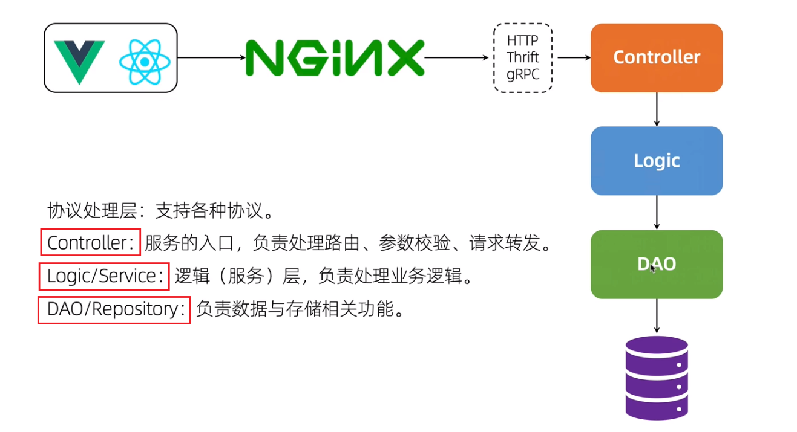
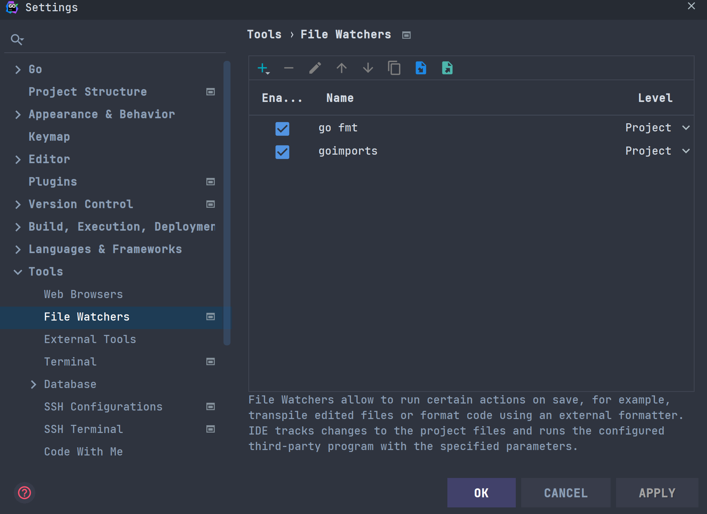
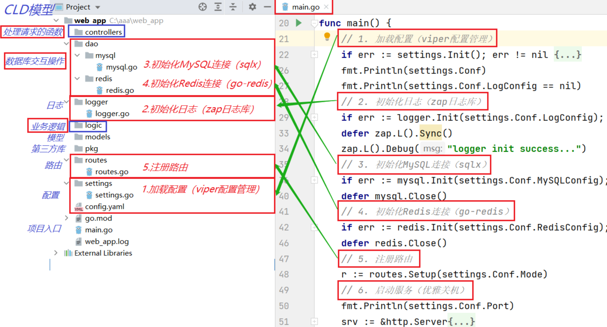

# 论坛架构



# 项目框架搭建

## IDE设置

安装插件: `file watcher`



> 配置代理 和 Go Modules

```
GOPROXY=https://goproxy.cn,direct
```

## 项目框架



> 初始化main.go

```go
func main() {
	
    // 0. 命令行参数指定配置文件
    var configFileName string
	flag.StringVar(&configFileName, "config", "./config.yaml", "配置文件")
	flag.Parse()
    
	// 1. 加载配置文件
	
	// 2. 初始化日志
	
	// 3. 初始化数据库链接
	
	// 4. 路由注册
	
	// 5. 启动服务（优雅关机）

}
```

## 配置文件

### config.yaml

```yaml
name: "forumProject"
# 控制项目模式，决定日志输出的位置
mode: "dev"
port: 8081
version: "v0.1.1"

# 雪花算法：开始时间 机器ID
start_time: "2023-11-14"
machine_id: 1

# 加密盐
salt: "elevenProject"

# 退出等待时间
wait_time: 20
# Log
log:
  level: "debug"
  filename: "../log/forumProject.log"
  max_size: 200
  max_age: 30
  max_backups: 7
# MYSQL
mysql:
  host: "127.0.0.1"
  port: 3306
  user: "root"
  password: "rootroot"
  dbname: "test"
  max_open_conns: 200
  max_idle_conns: 50
# Redis
redis:
  host: "127.0.0.1"
  port: 6379
  password: "root"
  db: 0
  pool_size: 100
```

### settings/settings.go 

```go
package settings

import (
	"fmt"

	"github.com/fsnotify/fsnotify"
	"github.com/spf13/viper"
)

// Conf 全局变量，用来保存程序的所有配置信息
var Conf = new(AppConfig) // 返回的是地址

type AppConfig struct {
	Name         string `mapstructure:"name"`
	Mode         string `mapstructure:"mode"`
	Version      string `mapstructure:"version"`
	Port         int    `mapstructure:"port"`
	StartTime    string `mapstructure:"start_time"`
	MachineID    uint16  `mapstructure:"machine_id"`
	WaitTime     int    `mapstructure:"wait_time"`
    Salt         string `mapstructure:"salt"`
	*LogConfig   `mapstructure:"log"`
	*MySQLConfig `mapstructure:"mysql"`
	*RedisConfig `mapstructure:"redis"`
}

type LogConfig struct {
	Level      string `mapstructure:"level"`
	Filename   string `mapstructure:"filename"`
	MaxSize    int    `mapstructure:"max_size"`
	MaxAge     int    `mapstructure:"max_age"`
	MaxBackups int    `mapstructure:"max_backups"`
}

type MySQLConfig struct {
	Host         string `mapstructure:"host"`
	User         string `mapstructure:"user"`
	Password     string `mapstructure:"password"`
	DbName       string `mapstructure:"dbname"`
	Port         int    `mapstructure:"port"`
	MaxOpenConns int    `mapstructure:"max_open_conns"`
	MaxIdleConns int    `mapstructure:"max_idle_conns"`
}

type RedisConfig struct {
	Host     string `mapstructure:"host"`
	Password string `mapstructure:"password"`
	Port     int    `mapstructure:"port"`
	DB       int    `mapstructure:"db"`
	PoolSize int    `mapstructure:"pool_size"`
}

func Init(configFileName string) (err error) {

	// 1.相对路径（是相对于执行的位置）
	viper.SetConfigFile(configFileName)

	// 2.注意不要重名
	//viper.SetConfigName("config")
	//viper.AddConfigPath(".")
	//viper.AddConfigPath("./conf")

	// 3.远程配置中心获取 使用什么格式去解析
    //viper.SetConfigName("config") // 配置文件名称(无扩展名)
    //viper.SetConfigType("yaml")   // 如果配置文件的名称中没有扩展名，则需要配置此项

	// 读取配置文件
	if err := viper.ReadInConfig(); err != nil {
		if _, ok := err.(viper.ConfigFileNotFoundError); ok {
			fmt.Println("Not Found config! ")
		} else {
			fmt.Printf("Fatal error config file: %s \n", err)
		}
	}

	// 把读取到的配置信息反序列化到 Conf 变量中
	if err := viper.Unmarshal(Conf); err != nil {
		fmt.Printf("viper.Unmarshal failed, err:%v\n", err)
	}

	viper.WatchConfig()
	// 监听配置文件
	viper.OnConfigChange(func(in fsnotify.Event) {
		fmt.Println("配置文件修改了")
        // 重新再序列化
		if err := viper.Unmarshal(Conf); err != nil {
			fmt.Printf("viper.Unmarshal failed, err:%v\n", err)
		}
        fmt.Println("修改内容重新加载到全局Config")
	})

	return nil
}
```

### main.go

```go
func main() {
	
	// 1. 加载配置文件
	if err := settings.Init(configFileName); err != nil {
		fmt.Printf("init settings failed, err:%#v\n", err)
		return
	}
	fmt.Println("settings init success...")

}
```

## 初始化日志

### logger/logger.go

```go
package logger

import (
   "forumProject/settings"
   "net"
   "net/http"
   "net/http/httputil"
   "os"
   "runtime/debug"
   "strings"
   "time"

   "github.com/gin-gonic/gin"

   "go.uber.org/zap"
   "go.uber.org/zap/zapcore"
   "gopkg.in/natefinch/lumberjack.v2"
)

var lg *zap.Logger

func Init(cfg *settings.LogConfig, mode string) (err error) {
   // 指定日志将写到哪里去
//	    lumberJackLogger := &lumberjack.Logger{
//	    Filename:   "../../log/test.log",
//		MaxSize:    1,     // M
//		MaxBackups: 5,     // 最大备份数量
//		MaxAge:     30,    // 最大备份天数
//		Compress:   false, //是否压缩
	}
   writeSyncer := getLogWriter(
      cfg.Filename,
      cfg.MaxSize,
      cfg.MaxBackups,
      cfg.MaxAge)

   encoder := getEncoder()
   l := new(zapcore.Level)
   err = l.UnmarshalText([]byte(cfg.Level))
   if err != nil {
      return
   }

   var core zapcore.Core

   if mode == "dev" {
      // 进入开发模式，日志输出到终端
      consoleEncoder := zapcore.NewConsoleEncoder(zap.NewDevelopmentEncoderConfig())
      core = zapcore.NewTee(
         zapcore.NewCore(encoder, writeSyncer, l),
         zapcore.NewCore(consoleEncoder, zapcore.Lock(os.Stdout), zapcore.DebugLevel),
      )
   } else {
      // 如果不是dev模式，就记录日志到日志文件中
      core = zapcore.NewCore(encoder, writeSyncer, l)
   }

   lg = zap.New(core, zap.AddCaller())

   zap.ReplaceGlobals(lg) //使用zap.L().Info() 替换zap.lg.Info(...)

   return
}
func getEncoder() zapcore.Encoder {
   encoderConfig := zap.NewProductionEncoderConfig()
   encoderConfig.EncodeTime = zapcore.ISO8601TimeEncoder
   encoderConfig.TimeKey = "time"
   encoderConfig.EncodeLevel = zapcore.CapitalLevelEncoder
   encoderConfig.EncodeDuration = zapcore.SecondsDurationEncoder
   encoderConfig.EncodeCaller = zapcore.ShortCallerEncoder
   return zapcore.NewJSONEncoder(encoderConfig)
}

func getLogWriter(filename string, maxSize, maxBackup, maxAge int) zapcore.WriteSyncer {
   lumberJackLogger := &lumberjack.Logger{
      Filename:   filename,
      MaxSize:    maxSize,
      MaxBackups: maxBackup,
      MaxAge:     maxAge,
   }
   return zapcore.AddSync(lumberJackLogger)
}

// GinLogger 接收gin框架默认的日志
// 通过中间件的方式嵌入
func GinLogger() gin.HandlerFunc {
   return func(c *gin.Context) {
      start := time.Now()
      path := c.Request.URL.Path
      query := c.Request.URL.RawQuery
      c.Next()

      cost := time.Since(start)
      lg.Info(path,
         zap.Int("status", c.Writer.Status()),
         zap.String("method", c.Request.Method),
         zap.String("path", path),
         zap.String("query", query),
         zap.String("ip", c.ClientIP()),
         zap.String("user-agent", c.Request.UserAgent()),
         zap.String("errors", c.Errors.ByType(gin.ErrorTypePrivate).String()),
         zap.Duration("cost", cost),
      )
   }
}

// GinRecovery recover掉项目可能出现的panic，并使用zap记录相关日志
// 通过中间件的方式嵌入
func GinRecovery(stack bool) gin.HandlerFunc {
   return func(c *gin.Context) {
      defer func() {
         if err := recover(); err != nil {
            // Check for a broken connection, as it is not really a
            // condition that warrants a panic stack trace.
            var brokenPipe bool
            if ne, ok := err.(*net.OpError); ok {
               if se, ok := ne.Err.(*os.SyscallError); ok {
                  if strings.Contains(strings.ToLower(se.Error()), "broken pipe") || strings.Contains(strings.ToLower(se.Error()), "connection reset by peer") {
                     brokenPipe = true
                  }
               }
            }

            httpRequest, _ := httputil.DumpRequest(c.Request, false)
            if brokenPipe {
               lg.Error(c.Request.URL.Path,
                  zap.Any("error", err),
                  zap.String("request", string(httpRequest)),
               )
               // If the connection is dead, we can't write a status to it.
               c.Error(err.(error)) // nolint: errcheck
               c.Abort()
               return
            }

            if stack {
               lg.Error("[Recovery from panic]",
                  zap.Any("error", err),
                  zap.String("request", string(httpRequest)),
                  zap.String("stack", string(debug.Stack())),
               )
            } else {
               lg.Error("[Recovery from panic]",
                  zap.Any("error", err),
                  zap.String("request", string(httpRequest)),
               )
            }
            c.AbortWithStatus(http.StatusInternalServerError)
         }
      }()
      c.Next()
   }
}
```

### main.go

```go
func main() {
	
	// 2. 初始化日志
    if err := logger.Init(settings.Conf.LogConfig, settings.Conf.Mode); err != nil {
		fmt.Printf("init logger failed, err:%#v\n", err)
		return
	}
	defer zap.L().Sync()
	zap.L().Debug("logger init success...")
	
}
```

## 初始化数据库

### dao/mysql/mysql.go

```go
package mysql

import (
   "fmt"
   "forumProject/settings"

   _ "github.com/go-sql-driver/mysql"
   "github.com/jmoiron/sqlx"
   "go.uber.org/zap"
)

var db *sqlx.DB

func Init(cfg *settings.MySQLConfig) (err error) {
   dsn := fmt.Sprintf("%s:%s@tcp(%s:%d)/%s?charset=utf8mb4&parseTime=True",
      cfg.User,
      cfg.Password,
      cfg.Host,
      cfg.Port,
      cfg.DbName,
   )
   // 也可以使用MustConnect连接不成功就panic
   db, err = sqlx.Connect("mysql", dsn)
   if err != nil {
      zap.L().Error("connect DB failed", zap.Error(err))
      return
   }
   db.SetMaxOpenConns(cfg.MaxOpenConns)
   db.SetMaxIdleConns(cfg.MaxIdleConns)
   return
}

// 小技巧：对外暴露db
func Close() {
   _ = db.Close()
}
```

### dao/mysql/redis.go

```go
package redis

import (
	"fmt"
	"forumProject/settings"

	"github.com/go-redis/redis"
)

// 声明一个全局的rdb变量
var rdb *redis.Client

// Init 初始化连接
func Init(cfg *settings.RedisConfig) (err error) {
	rdb = redis.NewClient(&redis.Options{
		Addr: fmt.Sprintf("%s:%d",
			cfg.Host,
			cfg.Port,
		),
		Password: cfg.Password, // no password set
		DB:       cfg.DB,       // use default DB
		PoolSize: cfg.PoolSize,
	})

	_, err = rdb.Ping().Result()
	return
}

func Close() {
	_ = rdb.Close()
}

```

### main.go

```go
func main() {
	
	/*
		3. 初始化数据库链接
	*/
	// 3.1 初始化MySQL连接（sqlx）
	if err := mysql.Init(settings.Conf.MySQLConfig); err != nil {
		fmt.Printf("init mysql failed, err:%v\n", err)
		return
	}
	defer mysql.Close()
	zap.L().Debug("mysql init success...")
    
    // 3.2 初始化Redis连接（go-redis）
	if err := redis.Init(settings.Conf.RedisConfig); err != nil {
		fmt.Printf("init redis failed, err:%v\n", err)
		return
	}
	defer redis.Close()
	zap.L().Debug("redis init success...")

}
```

## 初始化路由

### routers/routes.go

```go
package routes

import (
	"forumProject/logger"
	"forumProject/settings"
	"net/http"
	"time"

	"github.com/gin-gonic/gin"
)

func Setup(mode string) *gin.Engine {
	if mode == gin.ReleaseMode {
		gin.SetMode(gin.ReleaseMode)
	}
	r := gin.New()
    // 嵌入日志中间件
	r.Use(logger.GinLogger(), logger.GinRecovery(true))

	r.GET("/version", func(c *gin.Context) {
		time.Sleep(10 * time.Second)
		c.String(http.StatusOK, settings.Conf.Version)
	})

	return r
}
```

### main

```go
func main() {
	
	// 4. 路由注册
	r := routes.Setup(settings.Conf.Mode)
	zap.L().Debug("routes init success...")

}
```

## 优雅关机

### main

```go
package main

import (
	"context"
	"flag"
	"fmt"
	"forumProject/dao/mysql"
	"forumProject/dao/redis"
	"forumProject/logger"
	"forumProject/routes"
	"forumProject/settings"
	"net/http"
	"os"
	"os/signal"
	"syscall"
	"time"

	"go.uber.org/zap"
)

func main() {

	// 0. flag参数指定配置文件
	var configFileName string
	flag.StringVar(&configFileName, "config", "./config.yaml", "配置文件")
	flag.Parse()

	// 1. 加载配置文件
	if err := settings.Init(configFileName); err != nil {
		fmt.Printf("init settings failed, err:%#v\n", err)
		return
	}
	fmt.Println("settings init success...")

	// 2. 初始化日志
	if err := logger.Init(settings.Conf.LogConfig, settings.Conf.Mode); err != nil {
		fmt.Printf("init logger failed, err:%#v\n", err)
		return
	}
	defer zap.L().Sync()
	zap.L().Debug("logger init success...")

	/*
		3. 初始化数据库链接
	*/
	// 3.1 初始化MySQL连接（sqlx）
	if err := mysql.Init(settings.Conf.MySQLConfig); err != nil {
		fmt.Printf("init mysql failed, err:%v\n", err)
		return
	}
	defer mysql.Close()
	zap.L().Debug("mysql init success...")

	// 3.2 初始化Redis连接（go-redis）
	if err := redis.Init(settings.Conf.RedisConfig); err != nil {
		fmt.Printf("init redis failed, err:%v\n", err)
		return
	}
	defer redis.Close()
	zap.L().Debug("redis init success...")

	// 4. 路由注册
	r := routes.Setup(settings.Conf.Mode)
	zap.L().Debug("routes init success...")

	// 5. 启动服务（优雅关机）
	srv := &http.Server{
		Addr:    fmt.Sprintf(":%d", settings.Conf.Port),
		Handler: r,
	}
	go func() {
		// 开启一个goroutine启动服务
		if err := srv.ListenAndServe(); err != nil && err != http.ErrServerClosed {
			zap.L().Fatal("listen: " + err.Error())
		}
	}()
	//
	// 等待中断信号来优雅地关闭服务器，为关闭服务器操作设置一个5秒的超时
	quit := make(chan os.Signal, 1) // 创建一个接收信号的通道
	// kill 默认会发送 syscall.SIGTERM 信号
	// kill -2 发送 syscall.SIGINT 信号，我们常用的Ctrl+C就是触发系统SIGINT信号
	// kill -9 发送 syscall.SIGKILL 信号，但是不能被捕获，所以不需要添加它
	// signal.Notify把收到的 syscall.SIGINT或syscall.SIGTERM 信号转发给quit
	signal.Notify(quit, syscall.SIGINT, syscall.SIGTERM) // 此处不会阻塞
	<-quit                                               // 阻塞在此，当接收到上述两种信号时才会往下执行
	zap.L().Info(fmt.Sprintf("触发关闭等待服务，将等待%ds", settings.Conf.WaitTime))
	// 创建一个5秒超时的context
	ctx, cancel := context.WithTimeout(context.Background(), 20*time.Second)
	defer cancel()
	// 5秒内优雅关闭服务（将未处理完的请求处理完再关闭服务），超过5秒就超时退出
	if err := srv.Shutdown(ctx); err != nil {
		zap.L().Fatal(fmt.Sprintf("等了%ds了还没好，先撤了...", settings.Conf.WaitTime), zap.Error(err))
	}

	zap.L().Info("所有请求处理完成,服务正常退出")
}
```


# 数据库设计

## 用户表表

### models/create_table.sql

```sql
DROP TABLE IF EXISTS `user`;
CREATE TABLE `user` (
    `id` bigint(20) NOT NULL AUTO_INCREMENT,
    `user_id` bigint(20) NOT NULL,
    `username` varchar(64) COLLATE utf8mb4_general_ci NOT NULL,
    `password` varchar(64) COLLATE utf8mb4_general_ci NOT NULL,
    `email` varchar(64) COLLATE utf8mb4_general_ci,
    `gender` tinyint(4) NOT NULL DEFAULT '0',
    `create_time` timestamp NULL DEFAULT CURRENT_TIMESTAMP,
    `update_time` timestamp NULL DEFAULT CURRENT_TIMESTAMP ON UPDATE CURRENT_TIMESTAMP,
    PRIMARY KEY (`id`),
    UNIQUE KEY `idx_username` (`username`) USING BTREE,
    UNIQUE KEY `idx_user_id` (`user_id`) USING BTREE
) ENGINE=InnoDB DEFAULT CHARSET=utf8mb4 COLLATE=utf8mb4_general_ci;
```

::: note user_id设计

`user_id bigint(20) NOT NULL`,为什么不是设置为数字的自增

1. 用户通过user_id就知道系统中有多少用户
2. 分库分表时会出现重复，不安全

:::

分布式的ID生成器就可以解决——**雪花算法**，特点如下

1. 全局唯一
2. 递增性
3. 高可用性：确保任何时候都能正确的生成ID
4. 高性能性：高并发下依然表现良好


# 业务流程

## 注册业务流程

1. route 		注册路由
2. control     1. 获取参数和参数校验 2.业务逻辑 3.返回值
3. logic        1. 判读用户存在 2.生成UID 3.入库
4. model       user struct
5. dao          1. 执行SQL语句

### route

route/route.go

```go
r.POST("/signup", controller.SignUpHandler)
```

### control

control/user.go

```go
func SignUpHandler(c *gin.Context){
	// 1. 获取参数和参数校验
    
    // 2. 业务逻辑
    
    // 3. 返回值
}
```

```go
func SignUpHandler(c *gin.Context){
	// 1. 获取参数和参数校验
    p := new(model.ParamSignUp) // 获取参数
    if err := c.ShouldBindJSON(p); err != nil{ // 参数校验
        zap.L().Error("xxx",zap.Error(err))
        c.JSON(http.StatusOK,gin.H{
            "msg":err.Error(),
        })
        return
    }
    // 2. 业务逻辑
    logic.SignUp()
    
	// 3. 返回值
	c.JSON(http.StatusOK, gin.H{
		"msg": "SignUpHandler successed",
	})
}
```

```go
// 2. 业务逻辑
if err := logic.SignUp(p); err != nil {
    c.JSON(http.StatusOK, gin.H{
        "msg": "用户名已被注册 "+err.Error(),
    })
    return
}
```


---

control/validator.go

提示：获取的语言是看`Accept-Language`

内置的错误信息实现翻译

```go
package controller

import (
	"fmt"
	"forumProject/models"
	"reflect"
	"strings"

	"github.com/gin-gonic/gin/binding"
	"github.com/go-playground/locales/en"
	"github.com/go-playground/locales/zh"
	ut "github.com/go-playground/universal-translator"
	"github.com/go-playground/validator/v10"
	enTranslations "github.com/go-playground/validator/v10/translations/en"
	zhTranslations "github.com/go-playground/validator/v10/translations/zh"
)

// 定义一个全局翻译器T
var trans ut.Translator

// InitTrans 初始化翻译器
func InitTrans(locale string) (err error) {
	// 修改gin框架中的Validator引擎属性，实现自定制
	if v, ok := binding.Validator.Engine().(*validator.Validate); ok {

		// 注册一个获取json tag的自定义方法
		v.RegisterTagNameFunc(func(fld reflect.StructField) string {
			name := strings.SplitN(fld.Tag.Get("json"), ",", 2)[0]
			if name == "-" {
				return ""
			}
			return name
		})

		// 为SignUpParam注册自定义校验方法
		v.RegisterStructValidation(SignUpParamStructLevelValidation, models.ParamSignUp{})

		zhT := zh.New() // 中文翻译器
		enT := en.New() // 英文翻译器

		// 第一个参数是备用（fallback）的语言环境
		// 后面的参数是应该支持的语言环境（支持多个）
		// uni := ut.New(zhT, zhT) 也是可以的
		uni := ut.New(enT, zhT, enT)

		// locale 通常取决于 http 请求头的 'Accept-Language'
		var ok bool
		// 也可以使用 uni.FindTranslator(...) 传入多个locale进行查找
		trans, ok = uni.GetTranslator(locale)
		if !ok {
			return fmt.Errorf("uni.GetTranslator(%s) failed", locale)
		}

		// 注册翻译器
		switch locale {
		case "en":
			err = enTranslations.RegisterDefaultTranslations(v, trans)
		case "zh":
			err = zhTranslations.RegisterDefaultTranslations(v, trans)
		default:
			err = enTranslations.RegisterDefaultTranslations(v, trans)
		}
		return
	}
	return
}

//定义一个去掉结构体名称前缀的自定义方法：
func removeTopStruct(fields map[string]string) map[string]string {
	res := map[string]string{}
	for field, err := range fields {
		res[field[strings.Index(field, ".")+1:]] = err
	}
	return res
}

// SignUpParamStructLevelValidation 自定义SignUpParam结构体校验函数
func SignUpParamStructLevelValidation(sl validator.StructLevel) {
	user := sl.Current().Interface().(models.ParamSignUp)

	if user.Password != user.RePassword {
		// 输出错误提示信息，最后一个参数就是传递的param
		sl.ReportError(user.RePassword, "re_password", "RePassword", "eqfield", "password")
	}
}
```

---

main.go 初始化Trans

```go
// 注册翻译器
if err := controller.InitTrans("zh"); err != nil {
    fmt.Printf("init validator InitTrans failed, err:%v\n", err)
    return
}
```

---

control/user.go

```go
package controller

import (
	"forumProject/logic"
	"forumProject/models"
	"net/http"

	"github.com/go-playground/validator/v10"

	"go.uber.org/zap"

	"github.com/gin-gonic/gin"
)

func SignUpHandler(c *gin.Context) {

	// 1. 获取参数和参数校验
	p := new(models.ParamSignUp)
	if err := c.ShouldBindJSON(p); err != nil {
		zap.L().Error("SignUp with invalid param", zap.Error(err))

		// 判断err类型是否是validator内置的类型
		errs, ok := err.(validator.ValidationErrors)
		if !ok {
			c.JSON(http.StatusOK, gin.H{
				"msg": err.Error(),
			})
			return
		}
		c.JSON(http.StatusOK, gin.H{
			"msg": errs.Translate(trans), // 使用翻译器
		})
		return
	}

	// 2. 业务逻辑
	logic.SignUp()

	// 3. 返回值
	c.JSON(http.StatusOK, gin.H{
		"msg": "successed",
	})
}

```

第一阶段测试：测试翻译器和参数限定


```go
func SignUpHandler(c *gin.Context) {

	// 1. 获取参数和参数校验
	p := new(models.ParamSignUp)
	if err := c.ShouldBindJSON(p); err != nil {
		zap.L().Error("SignUp with invalid param", zap.Error(err))

		// 判断err类型是否是validator内置的类型
		errs, ok := err.(validator.ValidationErrors)
		if !ok {
			c.JSON(http.StatusOK, gin.H{
				"msg": err.Error(),
			})
			return
		}
		c.JSON(http.StatusOK, gin.H{
			"msg": errs.Translate(trans), // 使用翻译器
		})
		return
	}

	// 2. 业务逻辑
	if err := logic.SignUp(p); err != nil {
		zap.L().Error("logic.SignUp failed", zap.String("username", p.Username), zap.Error(err))
		c.JSON(http.StatusOK, gin.H{
			"msg": "用户名已被注册",
		})
		return
	}

	// 3. 返回值
	c.JSON(http.StatusOK, gin.H{
		"msg": "SignUpHandler successed",
	})
```


### logic        

logic/user.go

```go
func SignUp(){
    
    // 1.判断用户是否存在
    
    // 2.生成UID
    
    // 3.入库
}
```

```go
func SignUp(p *models.ParamSignUp) (err error) {

	// 1.判断用户是否存在
	if err = mysql.CheckUserExist(p.Username); err != nil {
		return err
	}

	// 2.生成UID
	var userID uint64
	if userID, err = snowflake.GetID(); err != nil {
		return err
	}
	user := &models.User{
		UserID:   userID,
		UserName: p.Username,
		Password: p.Password,
	}

	// 3.入库
	if err = mysql.InsertUser(user); err != nil {
		return err
	}

	return
}

```

### model

model/user.go

```go
type ParamSignUp struct{
    Username string `json:"username" binding:"required"
    Password string `json:"password" binding:"required"
    RePassword string `json:"re_password" binding:"required,eqfied=Password"`
}

type User struct {
	UserID   uint64 `json:"user_id"`
	UserName string `json:"username"`
	Password string `json:"password"`
}
```

注意：`binding:"required,eqfied=Password"` 中间是用","分隔

### dao

dao/mysql/user.go

```go
// 查询用户是否存在
func CheckUserExist(){
    // SQL查询
    
    // 返回
}

// 添加用户
func InsertUser(){
    // 加密密码
    
    // 执行SQL
}

// 加密
```

```go
func CheckUserExist(username string) (err error) {

	sqlStr := `select count(user_id) from user where username = ?`
	var count int
	if err = db.Get(&count, sqlStr, username); err != nil {
		return err
	}
	if count > 0 {
		return errors.New("用户已存在")
	}
	return
}

func InsertUser(user *models.User) (err error) {

	// 对密码加密
	password := encryptPassword(user.Password)

	// 插入
	sqlStr := `insert into user(user_id,username,password) values(?,?,?)`
	_, err = db.Exec(sqlStr, user.UserID, user.UserName, password)

	return
}

func encryptPassword(oldPassword string) string {
	h := md5.New()
	h.Write([]byte(settings.Conf.Salt))
	return hex.EncodeToString(h.Sum([]byte(oldPassword)))
}
```

## 登录业务流程

### route

route/route.go

```go
r.POST("/login", controller.LoginHandler)
```

### control

control/user.go

```go
func LoginHandler(c *gin.Context) {
	// 1. 获取请求以及参数校验
    
    // 2. 业务逻辑处理
    
    // 3. 返回响应
}
```

```go
func LoginHandler(c *gin.Context) {
	// 1. 获取参数和参数校验
	p := new(models.ParamLogin)
	if err := c.ShouldBindJSON(p); err != nil {
		zap.L().Error("Login with invalid param", zap.Error(err))

		// 判断err类型是否是validator内置的类型
		errs, ok := err.(validator.ValidationErrors)
		if !ok {
			c.JSON(http.StatusOK, gin.H{
				"msg": err.Error(),
			})
			return
		}
		c.JSON(http.StatusOK, gin.H{
			"msg": errs.Translate(trans), // 使用翻译器
		})
		return
	}

	// 2.业务逻辑
	if err := logic.Login(p); err != nil {
		zap.L().Error("logic.Login failed", zap.String("username", p.Username), zap.Error(err))
		c.JSON(http.StatusOK, gin.H{
			"msg": "用户名或密码错误",
		})
		return
	}

	// 3.返回响应
	c.JSON(http.StatusOK, gin.H{
		"msg": "LoginHandler successed",
	})
}
```

### model

model/user.go

```go
type ParamLogin struct {
	Username string `json:"username" binding:"required"`
	Password string `json:"password" binding:"required"`
}
```

### logic

logic/user.go

```
func SignUp(){
    
    // 1.实例化user
    
    // 2.登录检验
    
}
```

```go
func Login(p *models.ParamLogin) error {

	// 实例化user
	user := &models.User{
		UserName: p.Username,
		Password: p.Password,
	}
	return mysql.Login(user)

}
```

### dao

dao/mysql/user.go

```
func Login(user *models.User) (err error) {
	// 保存用户传入的密码1
	
	// 通过用户名读取出库中密码2
	
	// 加密密码1与库中密码2比对
	
}
```

```go
func Login(user *models.User) (err error) {

	oldPassword := user.Password

	sqlStr := `select username,password from user where username = ?`
	err = db.Get(user, sqlStr, user.UserName)
	// 一般不会判断不存在，因为不能让用户知道
	if err == sql.ErrNoRows {
		return errors.New("用户不存在")
	}
	if err != nil {
		// 数据库错误
		return err
	}

	waitProvePassword := encryptPassword(oldPassword)
	if waitProvePassword != user.Password {
		return errors.New("密码错误")
	}
	return
}
```

### 难点

```go
if err == sql.ErrNoRows {
    return errors.New("用户不存在")
}

	// 2.业务逻辑
	if err := logic.Login(p); err != nil {
		//日志记录
		zap.L().Error("logic.Login failed", zap.String("username", p.Username), zap.Error(err))
		c.JSON(http.StatusOK, gin.H{
			"msg": "用户名或密码错误",
		})
		return
	}
```

